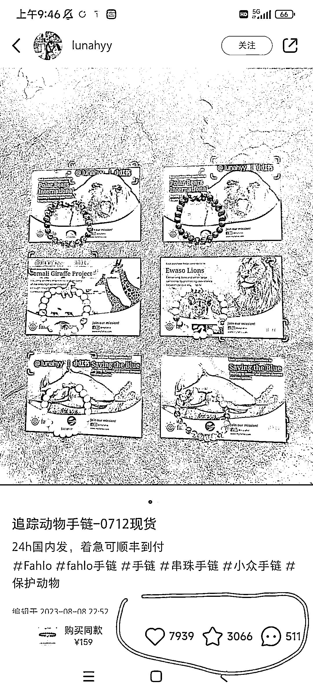
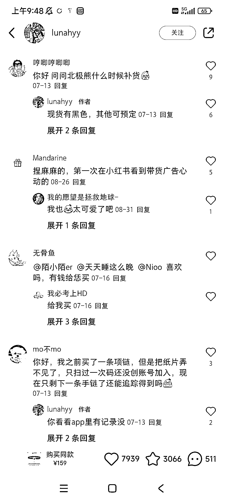
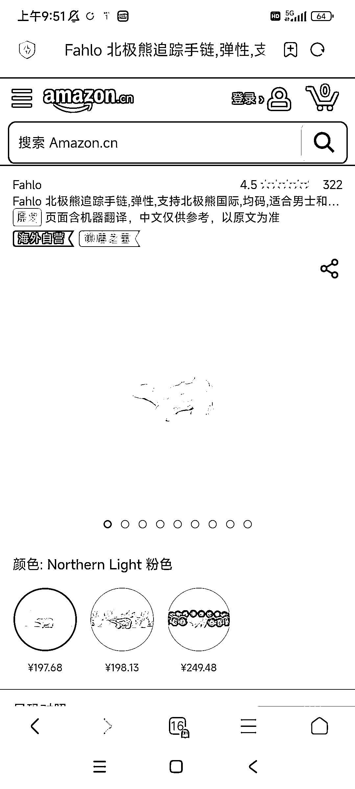

# 利用环保或公益组织背景，打造商品，在小红书平台获得高流量

> 原文：[`www.yuque.com/for_lazy/xkrm14/chll4ef4sddmu2z9`](https://www.yuque.com/for_lazy/xkrm14/chll4ef4sddmu2z9)

作者： 阿黎

日期：2023-10-08

点赞数：**70**

* * *

正文：

利用环保或者公益组织 ngo 作背景，打造商品，在小红书平台有很高流量。
图 1-4 是在小红书看到的，实际这个品是国外，早就爆过的，在小红书符合平台粉丝画像（环保、公益)，依然可以再爆! 当然亚马逊现在也有卖（图 5）

* * *

评论区：

Maritima : 这种商品应该如何打造呢~

阿黎 : 最接近的案例，供养一头奶牛，认养一亩茶田

朱朱侠 : 供养一尊佛，和寺庙结合，每天为供养人诵经祈祷，每周举办一次线上佛学课，每月做一次祈福挡灾的法事，同时配合禅修课转化高客单产品

* * *

