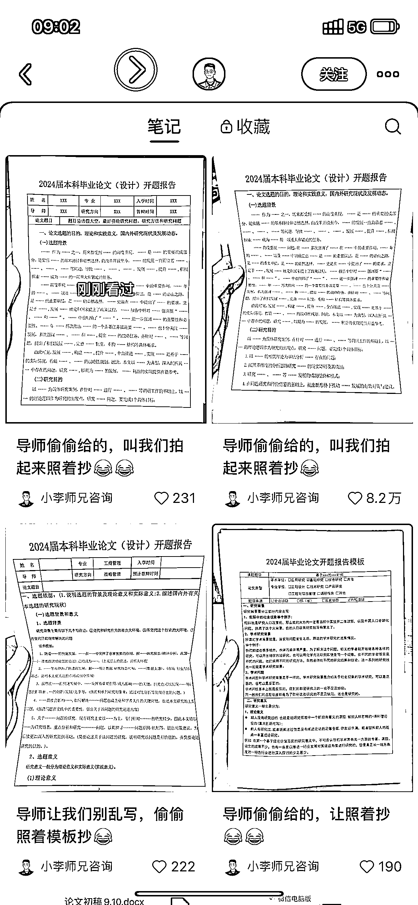
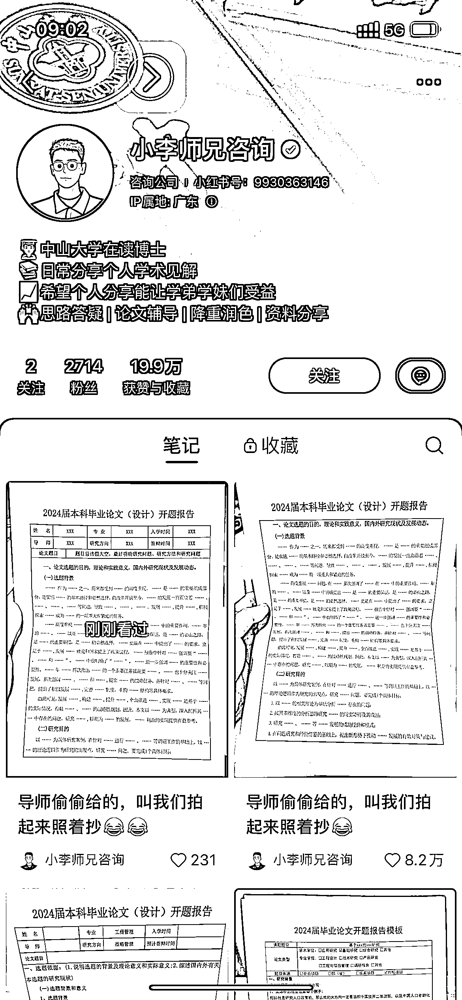

# 利用论文开题报告模板实现引流效果

> 原文：[`www.yuque.com/for_lazy/xkrm14/bgdytys8kliunwbl`](https://www.yuque.com/for_lazy/xkrm14/bgdytys8kliunwbl)

作者： 挖坑的萝卜🥕

日期：2023-09-26

点赞数：**69**

* * *

正文：

论文开题报告的模板引流

* * *

评论区：

胖大魔 : 论文呐

* * *

