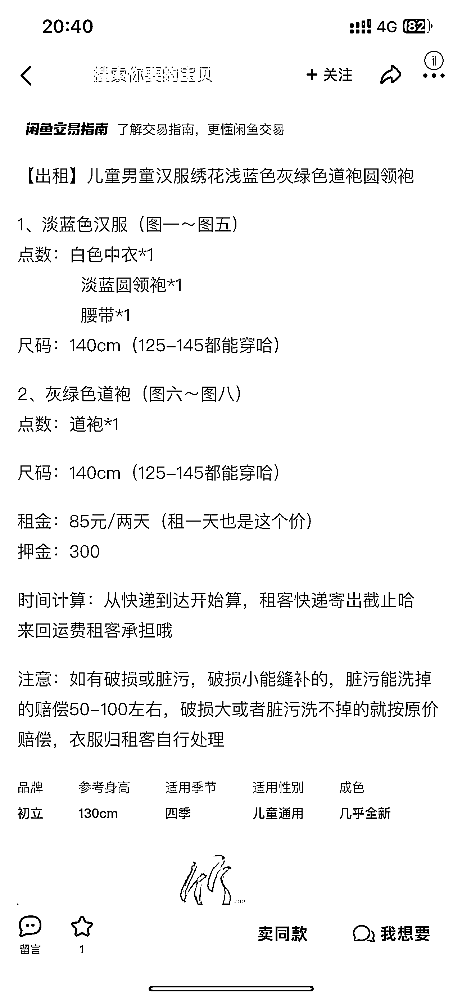

# 中秋季节，儿童汉服出租生意火爆，商机可观

> 原文：[`www.yuque.com/for_lazy/xkrm14/yf27c8akvnbrw2yv`](https://www.yuque.com/for_lazy/xkrm14/yf27c8akvnbrw2yv)

作者： bug 超会玩

日期：2023-09-26

点赞数：**73**

* * *

正文：

中秋了，幼儿园小学小朋友们都会组织活动，赏灯、灯谜、游戏。 仪式感很重要，学校一般会要求穿汉服，或者国风的衣服。
一般提前一周在网上买就好，但是学校一般都是一周内才通知。 所以很难及时的从网络上买到合适的服装。 这个时候，会去附近的照相馆看看，租借服装。
或者打开咸鱼，看看同城，有没有相关的服装。 一看发现了商机，确实有很多做儿童汉服出租的。 而且问了同城的十几家，有做代发的有做出租的，发现都没有货了。
说明生意非常的火爆。 进一步了解了一下，发现开学礼、开笔礼、诗词朗诵、毕业晚会等等活动，一般也会要求穿着这样的汉服。
现在家庭条件好，很多父母都给孩子买新的服装，只穿一次，就转手很低价格出了。 可以从电商渠道屯一些好看款式的服装，或者低价二手回收一些服装。
在每年特殊的活动时候，把衣服出租。基本上每年一两次活动，本钱就能回来了。 不说了，别问怎么发现的。正在开车去取衣服的路上。

* * *

评论区：

天使陷落 : 据我所知，这些汉服也不贵呀，网上买都比这租金便宜了

bug 超会玩 : 主要是要的急

柠檬 兰子 : 一般到货顶多三天，我们幼儿园提前一周就说啦，租金和买一件衣服价格差不多了

Northrp : 做的是粗心家长的生意[呲牙]有的前一天晚上才反应过来的要的急

* * *

公众号懒人找资源，懒人专属群分享