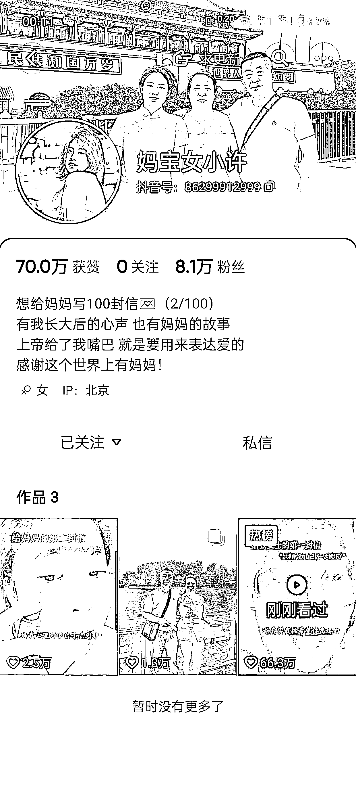

# 新的起号方式：给妈妈写一百封信，引起共鸣！

> 原文：[`www.yuque.com/for_lazy/xkrm14/hplemkw0kmump2vb`](https://www.yuque.com/for_lazy/xkrm14/hplemkw0kmump2vb)

作者： 老张

日期：2023-10-11

点赞数：**72**

* * *

正文：

刚刷抖音发现了一种新的起号方式，而且这种起号方式的内容平台目前来说应该都是比较少，或者说稀缺的，非常能引起共鸣！ 主题就是：想给妈妈写一百封信
第一天就直接账号拉起来了，后面的数据虽然没那么好，但是个人感觉这种方式起号还是很 OK 的，而且第 3 条作品就出现了产品在里面，这也有可能是他后面要走的带货方向之类的！个人认为是很值得对标的账号！

* * *

评论区：

老张 : 感谢大佬🙏

moss : 账号好像没有了

晨曦 : 刚看了下，这种起号方式，也可以做给孩子的 100 封信

清玄 : 有点像在下辉子那种 想看下一个见面的人

* * *

