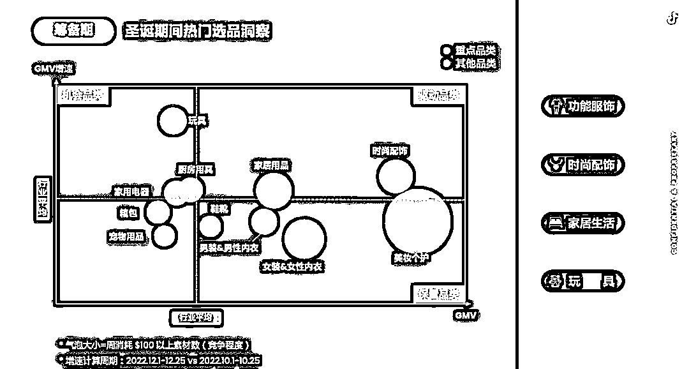

# 年末海外大促季即将开始，线上消费规模预计达 1.3 万亿美元

> 原文：[`www.yuque.com/for_lazy/xkrm14/pqxklkq48k6pti99`](https://www.yuque.com/for_lazy/xkrm14/pqxklkq48k6pti99)

作者： 李瑞腾

日期：2023-10-13

点赞数：**58**

* * *

正文：

年末海外大促季即将开始 在生活成本不断推高的当下，海外消费者无疑变得比过去更加在乎价格。相比起高频次的线下购物，他们更倾向于等待促销季，在
TikTok、Amazon、SHEIN 等线上平台上比价后再下单。 在 Adyen
所做的一项调研中，超过 40%的消费者今年比以往花费更多时间在网上寻找最优价格，超过 30%的消费者更倾向于等待促销季购物。
今年年末大促将迎来更大的线上消费规模。德勤发布的《2022 年假日零售报告》提到，2023 年末假日季零售总额预计会达到 1.3 万亿美元，其中线上消费总额将会占到 20%。
掌握热门品类，找准发力点 TikTok for Business 更鼓励商家在年末大促准备珠宝配饰、软装家居、宠物用品等 GMV
总量较小但增速更快的机会品类，而非美妆个护等红海品类。“大品类下的小热门”也能在竞争激烈的大促中打出差异化，比如拥挤的服饰配饰赛道，假发、节日小礼服、印花袜子是圣诞节选品的不错选择。
传播渠道上，随着千禧一代和 Z 世代购买力增强，社交媒体成为了越来越多消费者假日购物的参考。在德勤《2022 年假日零售报告》中，56%的千禧一代、60%的 Z 世代计划使用社交媒体进行假日购物，且这一数字近三年在不断增长。

* * *

评论区：

* * *

公众号懒人找资源，懒人专属群分享