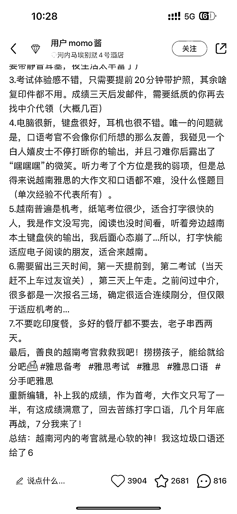
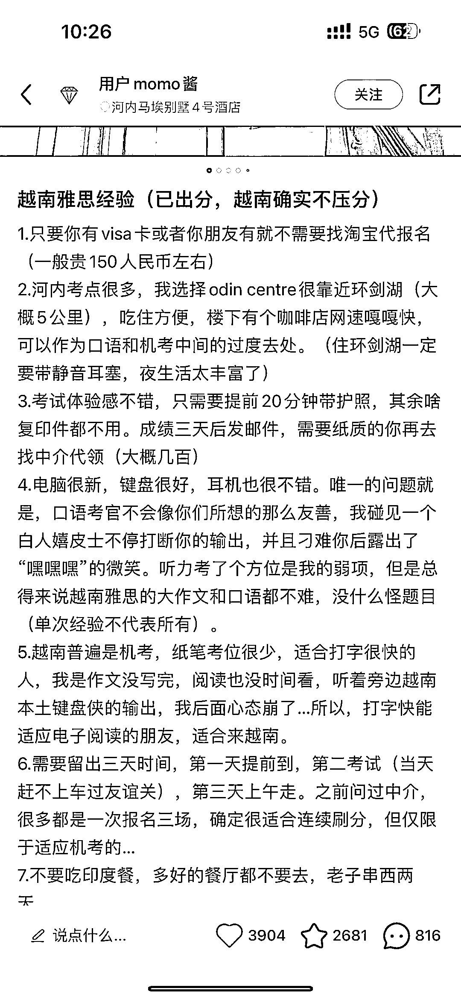
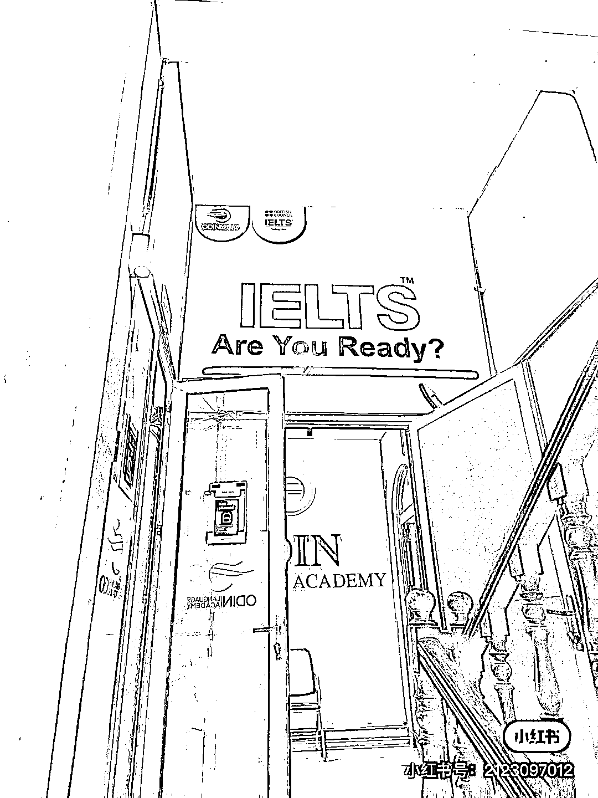
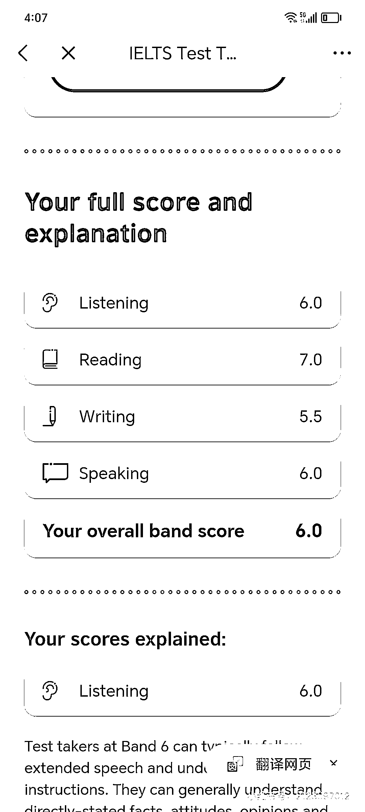

# 雅思新思路：探索最新的雅思备考方法

> 原文：[`www.yuque.com/for_lazy/xkrm14/vyoih16rgtrz26vn`](https://www.yuque.com/for_lazy/xkrm14/vyoih16rgtrz26vn)

作者： +1

日期：2023-10-08

点赞数：**49**

* * *

正文：

雅思新思路

* * *

评论区：

林元陸 : 很多大陆交换生也会在台湾考雅思，因为基本不需要等位。当然了，这种境外考雅思的最好要考虑清楚背后的风险，有些境外雅思分数很高的，就是因为利用时间差漏题的，而且出分以后有的中介也很阴险，直接威胁你打钱过去，不打钱就跟官方举报你作弊。

* * *

