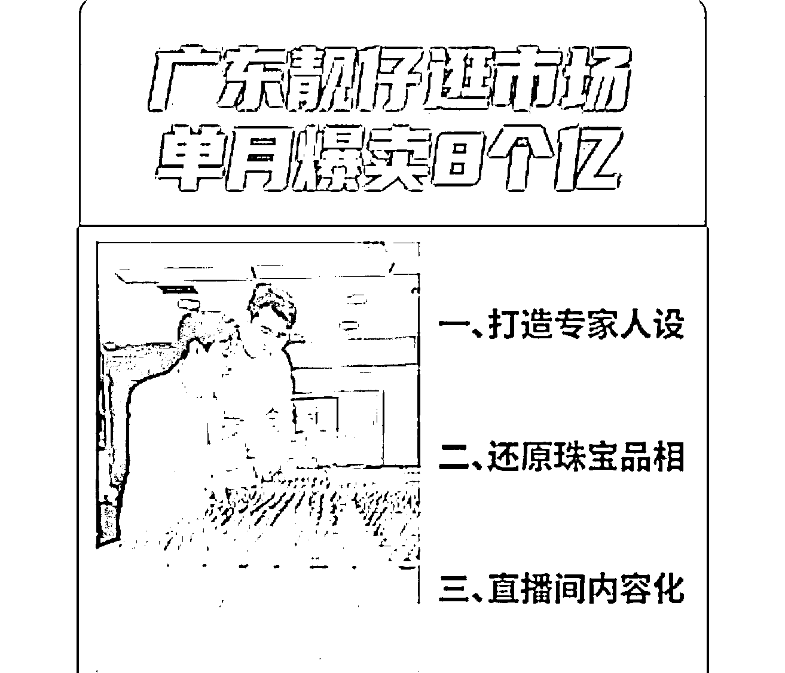

# 广东靓仔逛市场直播卖珠宝，月销 8 亿，卖法新奇引围观

> 原文：[`www.yuque.com/for_lazy/xkrm14/tezy1iigcfcl9vtt`](https://www.yuque.com/for_lazy/xkrm14/tezy1iigcfcl9vtt)

作者： 雨文

日期：2023-09-25

点赞数：**45**

* * *

正文：

300 万人围观。广东靓仔逛市场单月爆卖 8 个亿，因为卖法很新奇。
他直接去珠宝市场走播，跟店家看货，帮粉丝砍价。讲选品心法，把用户带入货源原产地，不仅让用户感觉产品便宜，更有三大好处。
一、是打造专家人设。珠宝单价高，他就以买手的角色替粉丝把关，增加信赖感转化更高。
二、是还原珠宝品相。珠宝在橱窗里光鲜亮丽，买回去常常货不对板，退货率奇高。他就在自然光下真实呈现珠宝，主打一个所见即所得。
三、是直播间内容化。他的观众大部分是"精致妈妈"人群，消费者全程围观，尤其砍价环节增加戏剧性，拿捏住用户爱看热闹的心理，停留时间更久，带动直播间销量蹭蹭上涨。
线下实体店珠宝交易减少，云上珠宝却十倍速规模增长。

* * *

评论区：

詹伟平 : 这个账号是在哪个平台卖

雨文 : 抖音，云上珠宝

* * *

