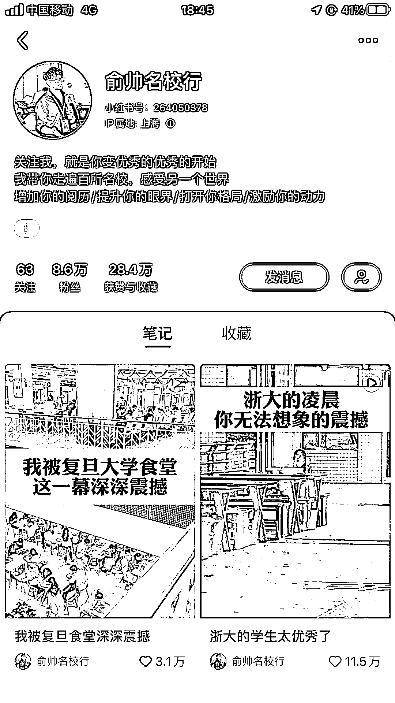
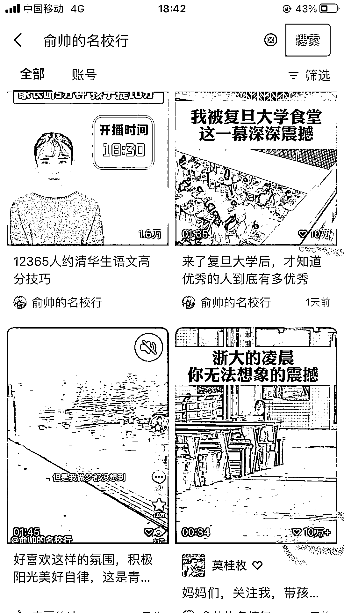

# 名校学生学习视频在各平台爆火，家长需求不减，变现机会多

> 原文：[`www.yuque.com/for_lazy/xkrm14/ivoxuhsd5ltbdw7k`](https://www.yuque.com/for_lazy/xkrm14/ivoxuhsd5ltbdw7k)

作者： 李治国

日期：2023-09-25

点赞数：**42**

* * *

正文：

以平视的视角介绍名校学校学生学习的视频内容在各平台爆火 偶然在小红刷到的，2 条视频 2.8 万赞，吸粉 8.6 万。 看这样的内容在别的平台怎么样？
抖音，2 条视频 21.5 万赞，17.7 万粉
视频号，2 条视频点赞均 10 万加，视频号直播 1.2 万人预约，发现朋友圈居然有 8 位好友共同关注。需求：取消校外辅导后，家长对孩子的教育需求是不会减少的。从视频内容看，介绍名校同学学习情况，校园环境，介绍校园学习的卷。我看了觉得解压。直接把这视频给孩子看，从案例角度就可激励到孩子。我有一个朋友，孩子高三，今年起每天早上 7 点准时给孩子发激励微信。
变现：抖音、小红书带货，卖高考书籍，文具。视频号针对家长卖高考辅导课程。

* * *

评论区：

李治国 : 谢谢，第一次发风向标中标了。开心😊

* * *

