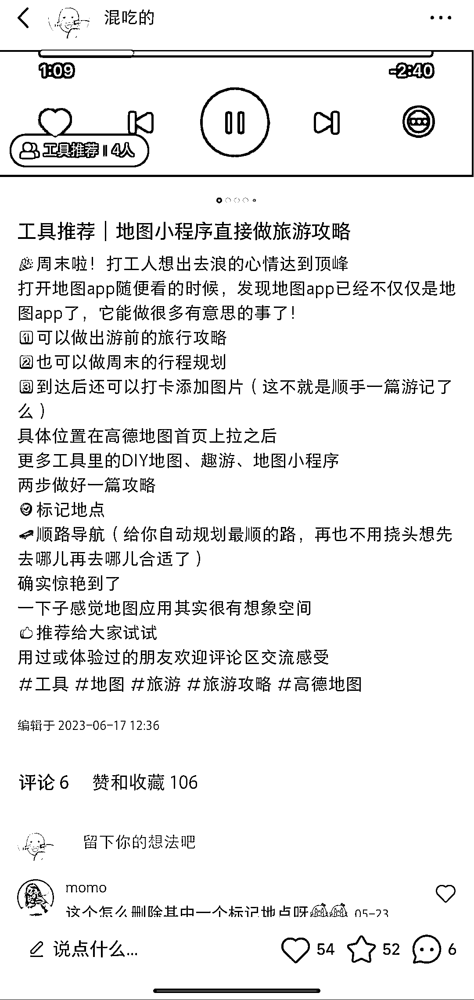
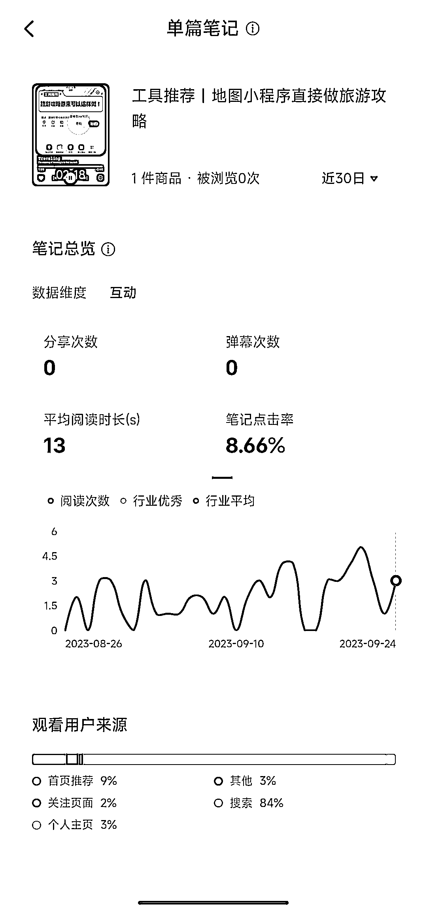

# 假期旅游攻略笔记增加流量

> 原文：[`www.yuque.com/for_lazy/xkrm14/nxg3639thcpkgssq`](https://www.yuque.com/for_lazy/xkrm14/nxg3639thcpkgssq)

作者： 占占

日期：2023-09-26

点赞数：**41**

* * *

正文：

小红书 逢假期，旅游攻略相关内容会增加一波流量 历史 2 月份发了一个旅游攻略工具的推荐笔记 五一的时候看到笔记点赞收藏增加了一波
近期快中秋十一了又开始有点赞和收藏 看了下近期的浏览来源主要是搜索，占比 80%以上 所以理解上有 2 点结论 1、逢假期，发旅游攻略相关内容会吸引一波流量
2、内容如果被小红书打上了旅游攻略相关标签，逢假期会涨一些流量，大家产出笔记的时候可以标签明确一些，方便吸引后续长尾得搜索流量
附上笔记内容和后台数据（不是大爆款，只是能印证上述 2 点猜测，仅供参考）

* * *

评论区：

* * *

