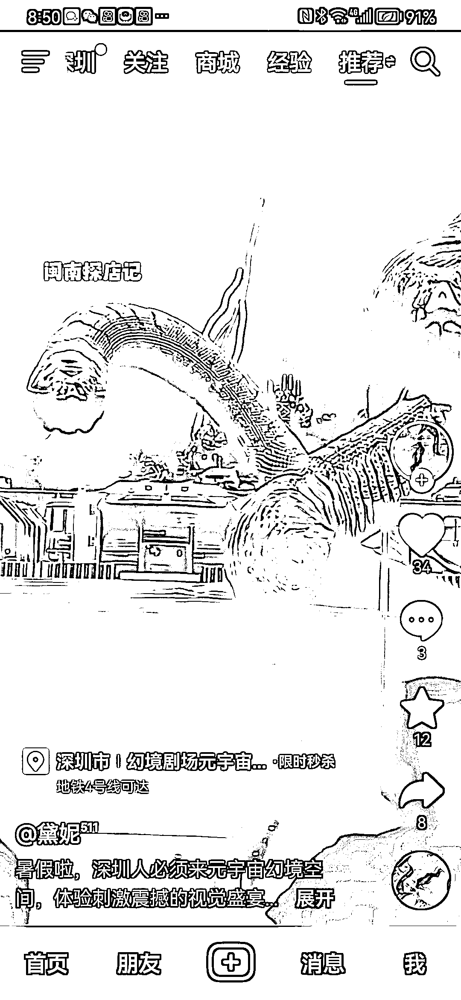

# 线下亲子剧场：史前动物主题，身临其境体验

> 原文：[`www.yuque.com/for_lazy/xkrm14/ytlibqn6yu2y311b`](https://www.yuque.com/for_lazy/xkrm14/ytlibqn6yu2y311b)

作者： 颜乐乐

日期：2023-09-26

点赞数：**40**

* * *

正文：

线下的 7d 剧场。针对的亲子带娃群体。主题是史前动物，一场 10 分钟两大一小 79.9。 已元宇宙身临其境，新奇吸引人。
估计很快各地都会开类似的，有点像很多年前的 3D 画展。

* * *

评论区：

* * *

