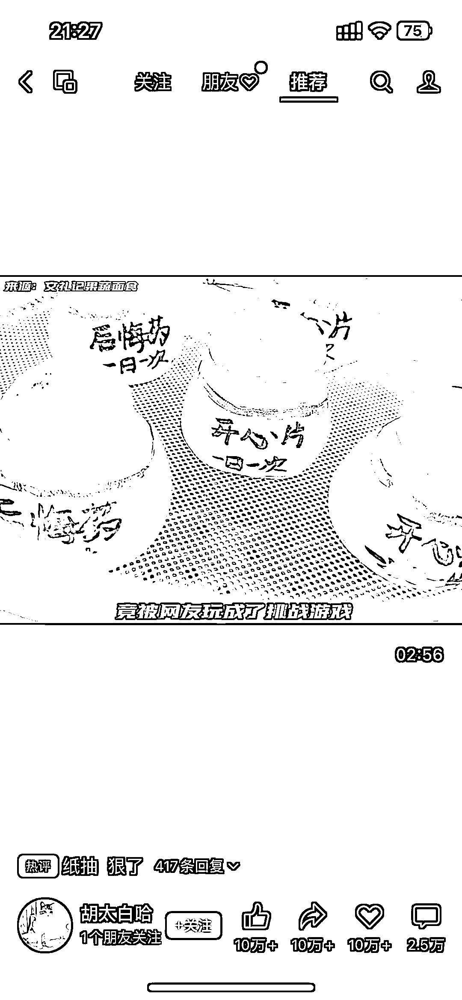

# 花式馒头博主引领新风向，流量和变现双丰收

> 原文：[`www.yuque.com/for_lazy/xkrm14/hxu1yxwzywsthvn4`](https://www.yuque.com/for_lazy/xkrm14/hxu1yxwzywsthvn4)

作者： 虾小米

日期：2023-10-11

点赞数：**49**

* * *

正文：

花式馒头新风向
1、流量：可以在视频号，小红书，抖音等频道做美食蒸馒头博主，吸引流量。附图这个博主的点赞，分享，收藏等都是 10 万➕，评论 2.5 万➕，可见这方面流量很高，具备一定的市场。
2、产品及变现：主要分几类，一类是像视频号博主一样专门发这类视频去引流，然后找到渠道跟他们建立合作去变现。
另一类就是自己报名学这类手艺，然后垂直做此类博主，在当地开个小店，线上引流线下吸引人购买，并且收徒，看评论有人说一节课一万多，想想利润多高，后期也可以学别人做教学视频，然后卖课盈利。

* * *

评论区：

虾小米 : 哇，竟然中标了，谢谢亦仁～

* * *

公众号懒人找资源，懒人专属群分享