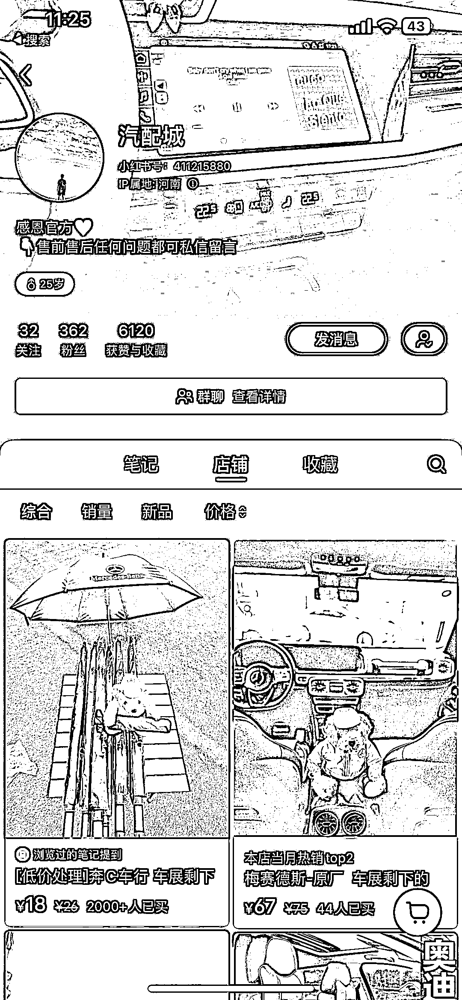

# 小红书爆款产品，销量翻倍，满足虚荣心的奢侈选择

> 原文：[`www.yuque.com/for_lazy/xkrm14/xgql0xln8vgqi71n`](https://www.yuque.com/for_lazy/xkrm14/xgql0xln8vgqi71n)

作者： 陈某

日期：2023-10-17

点赞数：**132**

* * *

正文：

小红书看到的爆款产品，第一次看到的时候是只卖了 1000 件。昨天看是 1965 到今天看就是两千多了。 他的核心点在我看来
1.选择相对奢侈的物件，但是我们又能买的到满足一下虚荣心
2.标题让人有想点进去的冲动，车展剩下的东西，如果继续往下翻这个账号会发现之前是卖饰品的。他现在卖的东西跟之前权重应该是没关系。
3.发布时间大概是一个早上 6 点，中午 12 点，下午 6 点

* * *

评论区：

小吴姐 : 好思路啊！

Unstoppabl* : 在闲鱼也爆了

涟漪 : 这种伞货源在哪呢？

字节叔叔 : 1688 搜了下，有货

表弟 : 哈哈 我还看到了劳斯莱斯的伞🌂

安可 : 我才发 1 分钟就有人问价格[惊恐]

陈某 : 就是这个雨伞吗，这么快

* * *

