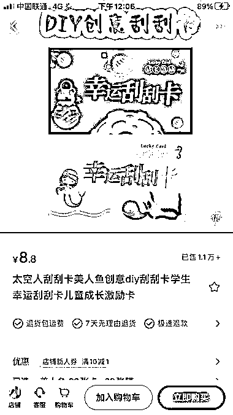
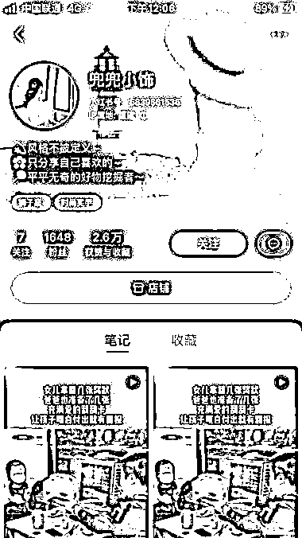
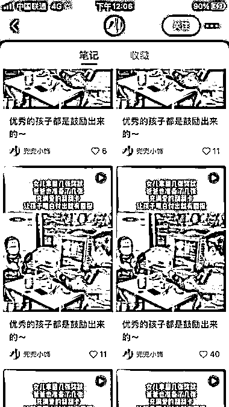

# 小红书上的带货刮刮卡笔记，销量 1.1 万，操作简单，效果惊人

> 原文：[`www.yuque.com/for_lazy/xkrm14/cq7yofwy5fozqsvs`](https://www.yuque.com/for_lazy/xkrm14/cq7yofwy5fozqsvs)

作者： 老金

日期：2023-10-18

点赞数：**96**

* * *

正文：

小红书上刷到一个带货刮刮卡的笔记，客单价 8.8 元，已销售 1.1 万，（图 1，图 1 是该博主的小红书店铺销量）
博主属于素人博主，粉丝数 1648（图 2），博主笔记基本上全是同一个视频（图 3）。 该玩法，操作简单，可以 1:1 仿拍后，通过不同文案，狂怼一个视频。

* * *

评论区：

陆陆 66 : 同一视频可以在同一账号不断重发吗？？

易文 : 刮刮卡是什么东西

星星 : 可以

星星 : 拼多多一搜

呀啦啦呼 : 啊啊啊，可以的吗？是所有平台都可以吗？如果真可以的话那就好惊喜

老金 : 感谢亦仁老师！

时光 : 不可以的，会判定重复和搬运。视频号，抖音，亲测

* * *

