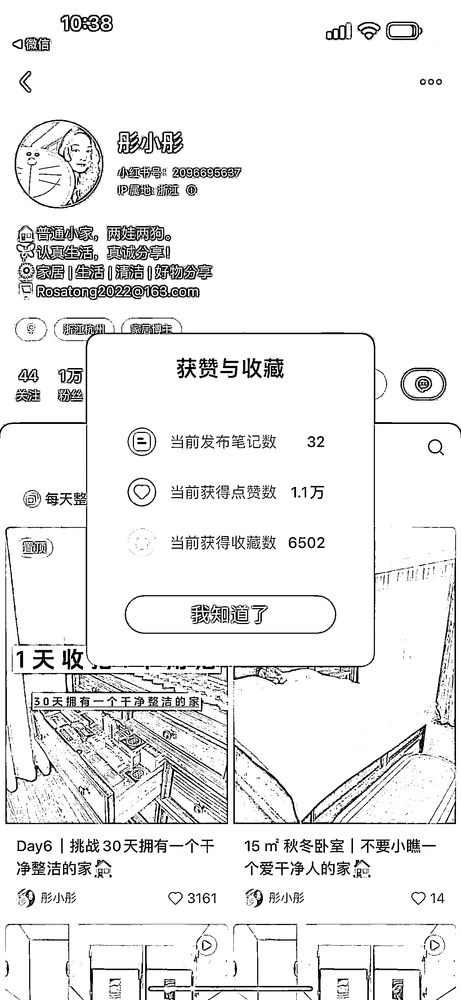
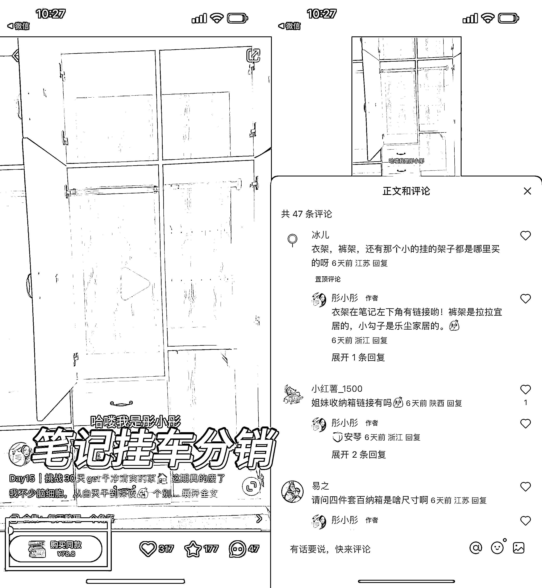

# 可复制的小红书玩法：30 天挑战家居收纳整理

> 原文：[`www.yuque.com/for_lazy/xkrm14/kbrfgrfdhcpnmkaw`](https://www.yuque.com/for_lazy/xkrm14/kbrfgrfdhcpnmkaw)

作者： 蔡文静好文静

日期：2023-10-16

点赞数：**84**

* * *

正文：

可复制的小红书玩法：挑战 30 天+每天更新一个家居收纳整理 32 篇笔记涨粉 1 万+。笔记挂车分销的店铺售卖量过万 内容玩法：
1、选题上：每天整理 1 个家里的角落。系列更新，让用户转粉率更加提高 2、封面图是收拾整齐的合集图。标题上：挑战 30 天拥有一个干净整洁的家。推送用户更加精准
3、固定选题+固定开头结尾+不同家居场景（卧室衣柜药柜。厨房。浴室等等） 短视频混剪+配音口播。而素人式的第一视角分享，能给人沉浸式的观感 变现方式：
1、接广告变现 2、部分笔记有挂车分销带货 3、未来延伸：公域私域分销合作各类家居家装类产品、直播带货等

* * *

评论区：

* * *

