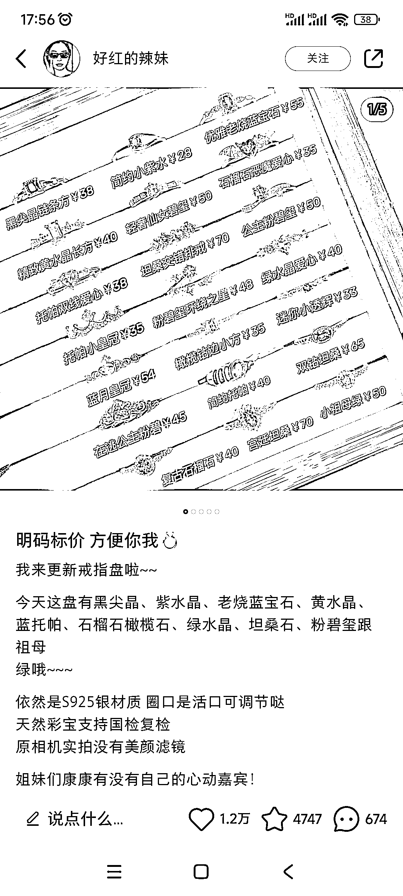

# 小红书饰品模板：明码标价，简单好操作

> 原文：[`www.yuque.com/for_lazy/xkrm14/ag0sauhz8zfd0p2k`](https://www.yuque.com/for_lazy/xkrm14/ag0sauhz8zfd0p2k)

作者： 阿黎

日期：2023-10-16

点赞数：**79**

* * *

正文：

小红书饰品有个模板很好用，直接把货摆成一板，然后标价。有规律有美感即可，简单好操作。主打一个一目了然，明码标价，这 2 点非常重要。

* * *

评论区：

艾小飞 : 不错，可以筛选掉目标人群

* * *

