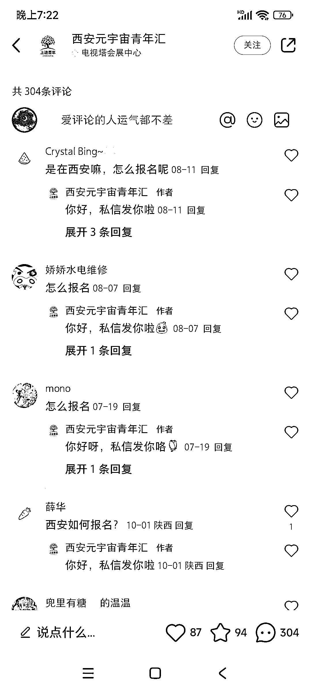
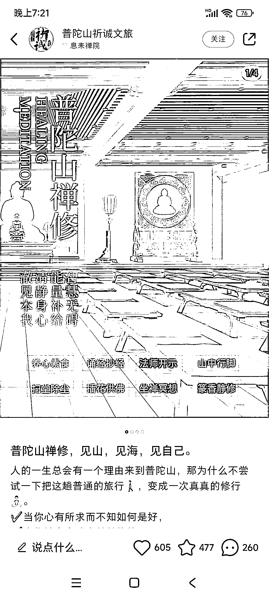
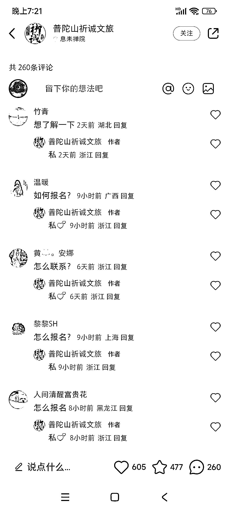
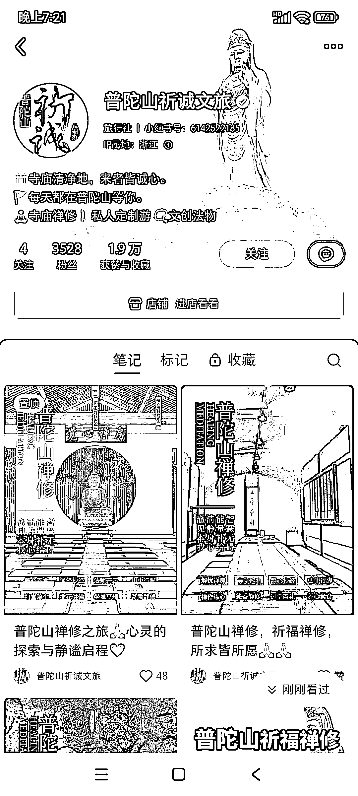
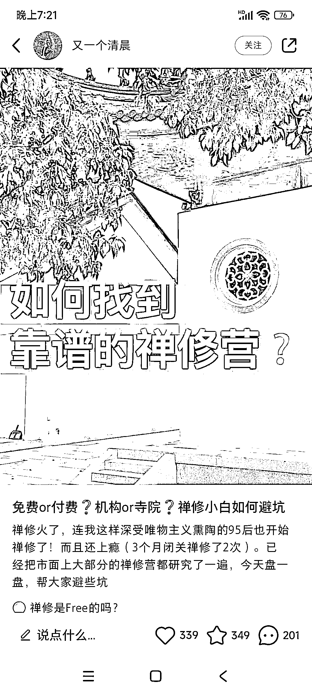
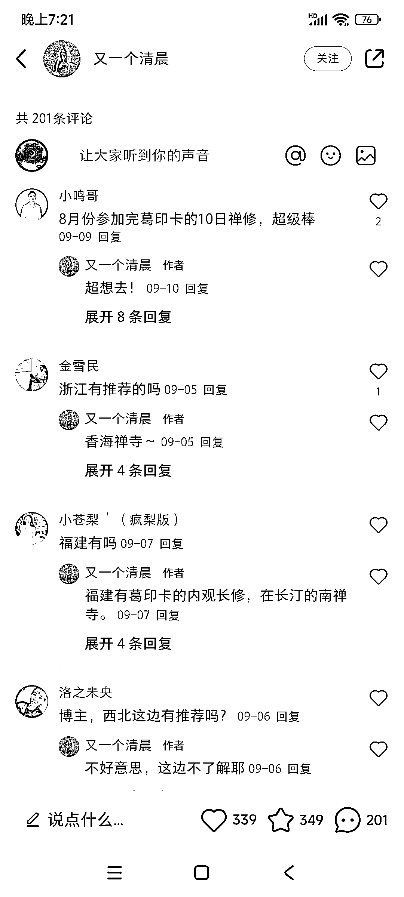
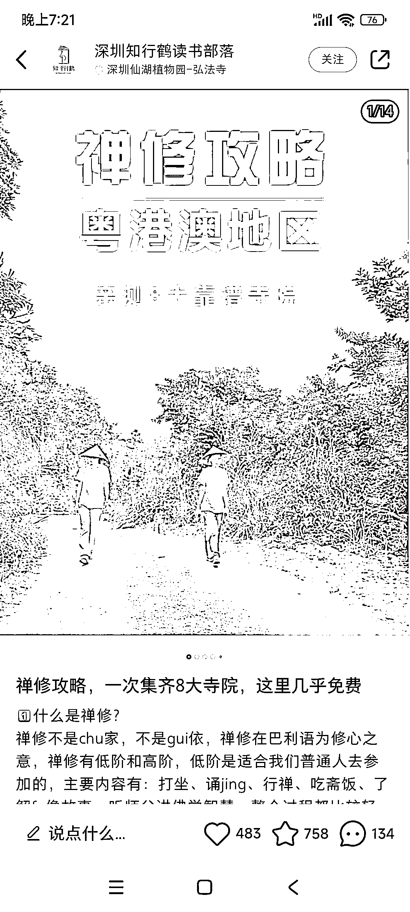

# 小红书禅修定制旅游需求旺盛，如何报名成热门问题

> 原文：[`www.yuque.com/for_lazy/xkrm14/zww7kgpdhtpho08r`](https://www.yuque.com/for_lazy/xkrm14/zww7kgpdhtpho08r)

作者： 阿黎

日期：2023-10-19

点赞数：**65**

* * *

正文：

小红书禅修定制旅游，需求很旺，图 1 的笔记，评论远高于点赞都是问 怎么报名 然后搜索了一下，各地都有很受欢迎的笔记。
非常适合线下实体，目测是又一个“线上自习室”的趋势

* * *

评论区：

阿黎 : 做一个合集，绝对会爆

小新 : 这个嘈杂的社会，非常需要静心。

丛政 : 我朋友在版纳做禅拍培训 体验 月流水百万以上 感兴趣的可以聊一下

* * *

