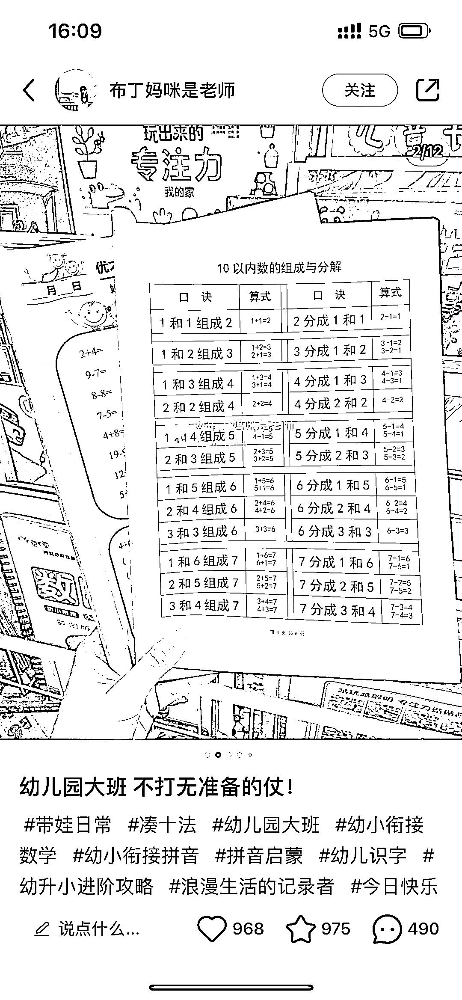

# 小红书账号成功吸引宝妈关注，引流效果显著

> 原文：[`www.yuque.com/for_lazy/xkrm14/ezlm2cuuekesxl95`](https://www.yuque.com/for_lazy/xkrm14/ezlm2cuuekesxl95)

作者： 袁大

日期：2023-10-25

点赞数：**69**

* * *

正文：

这种小红书发幼儿园引流资料的账号，确实很能吸引宝妈们的注意力。 资料打印出来，拍照，有真实感。 评论区互动性很强。 有需求+创意+真实+真诚
做啥事情都会换回“正反馈”。

* * *

评论区：

向北尘 : 这种怎么变现呢？

方 Sir : 一种是卖打印产品，一种是卖虚拟资料

本自具足 : 还可以引流到私欲，卖货 小孩上学用到的，自己和孩子日常生活用的，都可以卖

涟漪 : 这种资料哪里弄呢？

袁大 : 自己整理、某些培训机构有成品、某宝、多多搜一下

能量菌 : 孩子、姑娘、老人，需求永远饱满的群体

* * *

