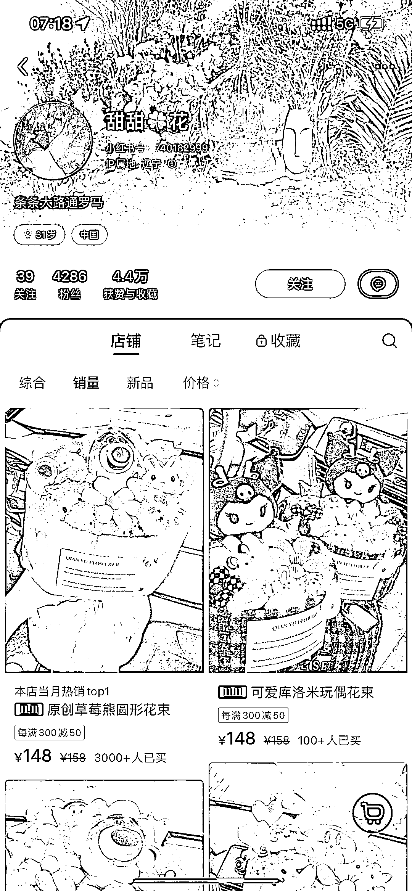
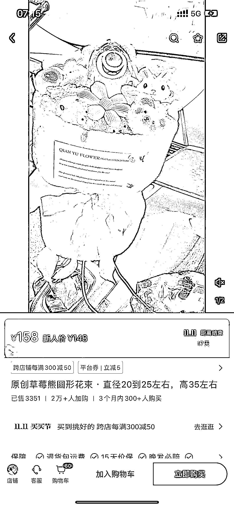

# 小红书卡通玩偶花束销售额 53w+，拼多多差价 100，赚取差价的玩法

> 原文：[`www.yuque.com/for_lazy/xkrm14/as88n8f7gf3u3zhf`](https://www.yuque.com/for_lazy/xkrm14/as88n8f7gf3u3zhf)

作者： 颜若一

日期：2023-10-26

点赞数：**101**

* * *

正文：

卡通玩偶花束，销售额 53w➕， 拼多多 58，小红书店铺 158，差价 100， 玩法： 拼多多进货，小红书放店铺里卖，赚差价 笔记内容：发各种不同玩偶花束的照片
评论区会有很多人问，xx 地方能不能发快递，某个卡通玩偶是不是有卖，都是意向客户

* * *

评论区：

能量菌 : 优秀[强]

颜若一 : 能量菌大佬多交流[害羞]

颜若一 : 感谢亦仁大大，连续三次中标，开心[害羞]

艾小飞 : 刚去看了，这条笔记是去年发的，可能是有搜索权重的加持，这篇笔记流量很稳定，但他其他发的笔记，就不如置顶的那篇了，不过现在在小红书上做无货源已经不行了，还有一种变现的思路，可以走私域无货源，小红书引流，微信承接，拼多多下单

颜若一 : 嗯呢，艾老师这个思路很好，转移阵地感觉也很可行！

* * *

