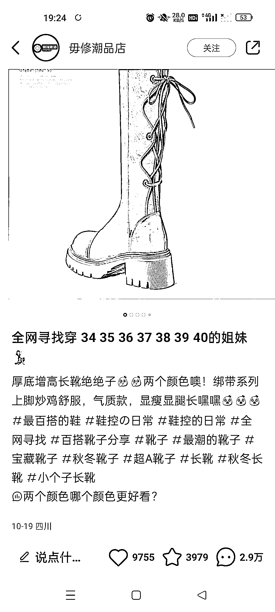
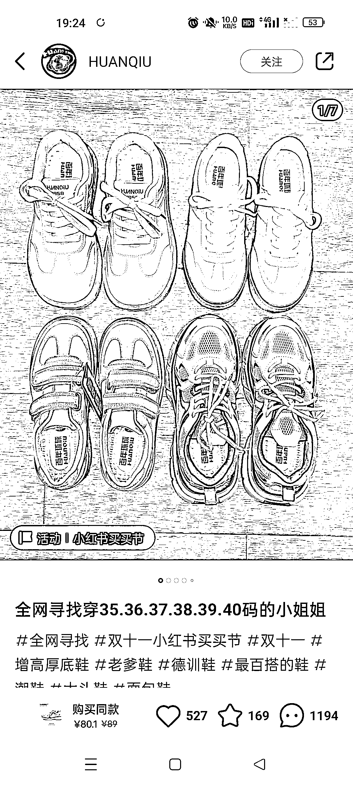
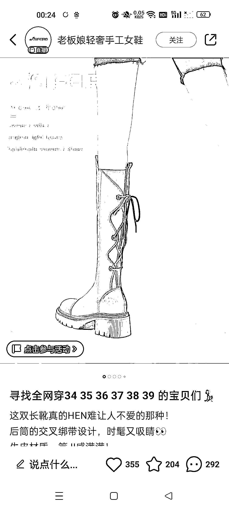

# 全网寻找各个尺码的姐妹，适用于小红书电商

> 原文：[`www.yuque.com/for_lazy/xkrm14/isgml6gdhkweolg7`](https://www.yuque.com/for_lazy/xkrm14/isgml6gdhkweolg7)

作者： 坏脾气的小可爱

日期：2023-10-26

点赞数：**72**

* * *

正文：

小红书电商可用标题 全网寻找：34.35.36.37.38.39.40 的姐妹。
这个标题基本上都概括了 90%的女生，这样的标题，出了好几个爆款。尤其最近双 11，流量都会推这相关的。
这个还可以换成全网寻找 100110.120.130 的姐妹。 从而换成衣服，或者还可以换成全网寻找 s m l xl 的姐妹。
里面都可以换，这个格式，可以继续用。

* * *

评论区：

能量菌 : 有意思

书情小跟班 : 有意思，哈哈😃

十巷 : 俗称，全网寻找式[偷笑]

* * *

