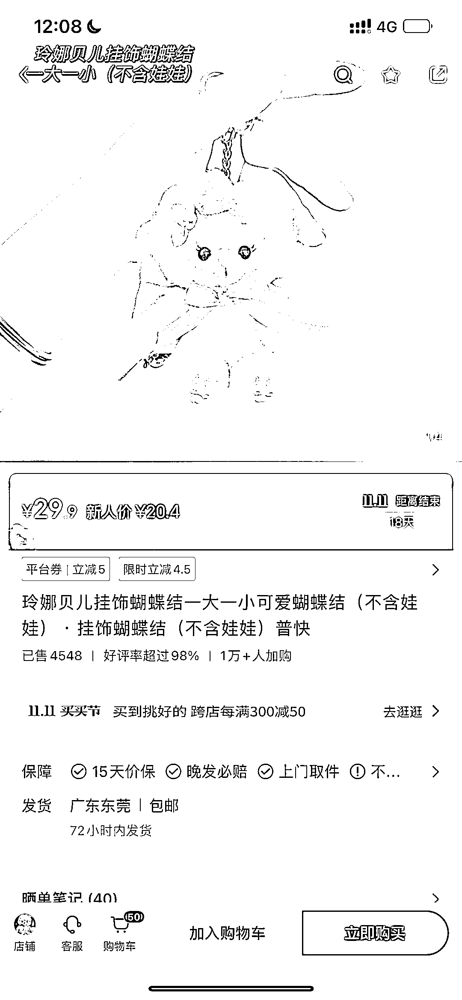
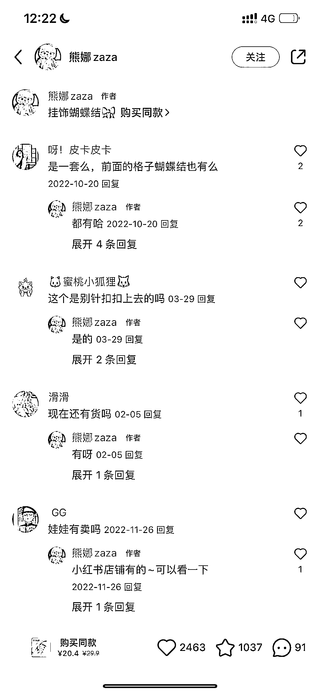

# 小红书店铺卖蝴蝶结+玲娜贝儿，15w 销售额，高利润商品

> 原文：[`www.yuque.com/for_lazy/xkrm14/gtmlvikp975btxnt`](https://www.yuque.com/for_lazy/xkrm14/gtmlvikp975btxnt)

作者： 颜若一

日期：2023-10-25

点赞数：**63**

* * *

正文：

15w 销售额，小红书店铺卖蝴蝶结🎀➕玲娜贝儿，高利润商品 玩法： 低成本物件绑定高热度 IP，低成本产品卖出高利润
蝴蝶结成本几块钱，绑定玲娜贝儿可以卖 30 一个，已经卖了 4500 多件 笔记内容只需要准备玲娜贝儿戴蝴蝶结的照片，
场景设定：挂包上，放车里，和宠物放一块，放家里各个角落 评论区都是在问怎么买，有没有货

* * *

评论区：

能量菌 : 低成本物件绑定高热度 IP，很有卖点

颜若一 : 谢谢亦仁大大[害羞]

颜若一 : 可以延展的玩法很多哇[得意]

雲 : 若一，真棒[强]

颜若一 : 谢谢阿祖[呲牙]

* * *

