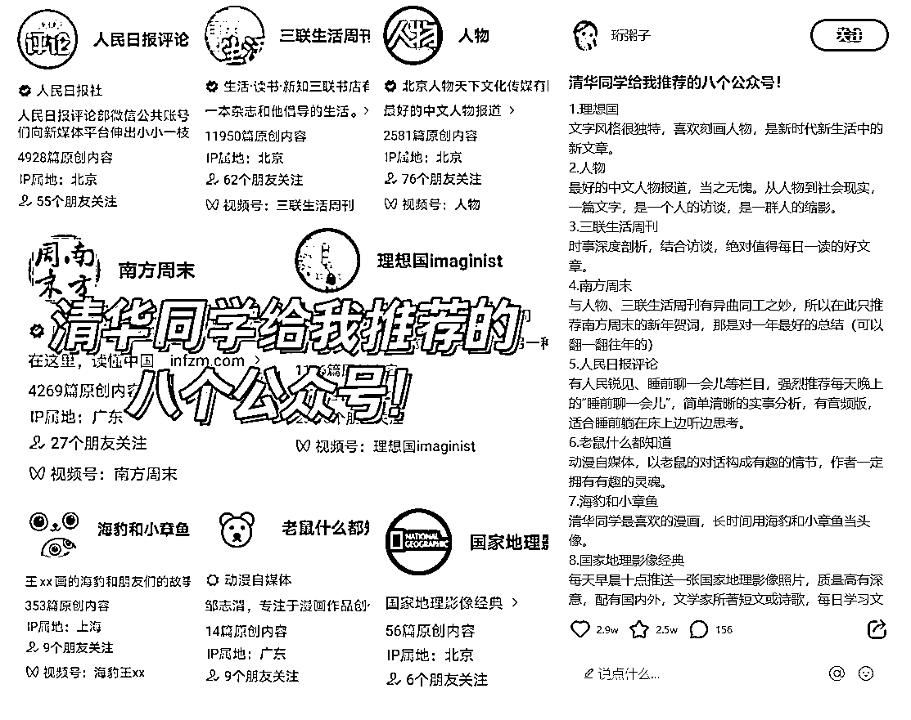

# 揭秘小红书笔记的不为人知的玩法：公号拼车

> 原文：[`www.yuque.com/for_lazy/xkrm14/ro5tgnnlugkyrfy9`](https://www.yuque.com/for_lazy/xkrm14/ro5tgnnlugkyrfy9)

作者： 深圳老刘

日期：2023-10-27

点赞数：**69**

* * *

正文：

这种推荐公众号小红书笔记大家不陌生吧。 这个里面其实有很多不为人知的玩法，叫公号拼车。
首先，是这里面弄 7，8 个主流公众号，再夹杂一二个自己想推的小号，实际给小号引流的目的。 其次，很多人已经演化为，全部公众号都是掏钱的，按价格多少排名。
最后，又有很多刷粉的博主，实际上没流量的号。也来拼车。有没有流量不管。反正发一条笔记少则几十，多则几百。可以把钱先赚了再说。

* * *

评论区：

田新一 : 请问，这种发车群怎么混呀？

程 : 同问

能量菌 : 小红书博主推荐公众号，收钱么？

书情小跟班 : 可以实操起来

没什么可说的 : 这种群怎么加呀 可以拉一下吗

周宇 : 上下游搞定了，组局开群的稳赚啊

涟漪 : 如何进这种发车群

* * *

