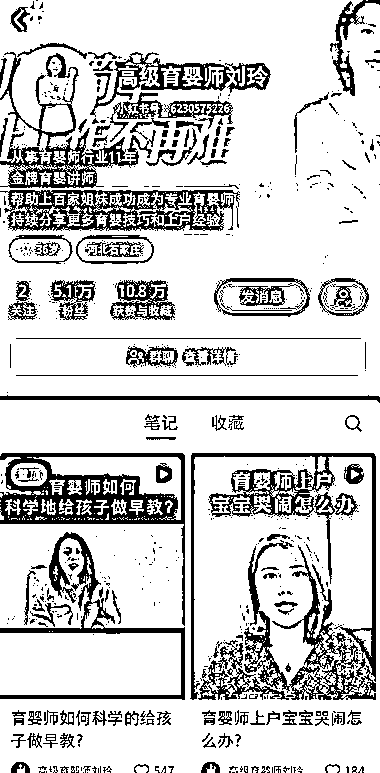

# 小红书上育婴师的三种变现方式

> 原文：[`www.yuque.com/for_lazy/xkrm14/kpkwqdndlrigkom5`](https://www.yuque.com/for_lazy/xkrm14/kpkwqdndlrigkom5)

作者： 流年

日期：2023-10-23

点赞数：**37**

* * *

正文：

育婴师在小红书的各种变现方式。
育婴师是对 0-3 岁婴儿的生活照料、护理和教育的，对于很多要兼顾工作和家庭的宝妈，一个育婴师可以帮宝妈节省一些时间做其他更重要的事，这个相对刚需。
育婴师在小红书上的 3 种变现方式： 1.做宝妈和育婴师双方的中间方，即整合宝妈和育婴师资源并根据需求匹配。
有些做了很多年的高级育婴师会在小红书做这类内容输出，吸引宝妈并引流到私域咨询转化。 2.考育婴师的证书咨询。
在学校上过学前教育相关专业的毕业生、自己本身是宝妈的人。 这两类人希望在育儿上更加专业，对考育婴师的证书有需求，变现方式是当地的考证咨询服务、考证服务。
如果自己有宝妈资源，同时也是宝妈，做中间方帮一些宝妈和育婴师的需求匹配也可以获得部分收益。
3.一些家政公司在小红书发育婴师相关的干货、案例等吸引目标用户咨询。 家政公司在小红书发内容引流到私域转化。

* * *

评论区：

* * *

公众号懒人找资源，懒人专属群分享