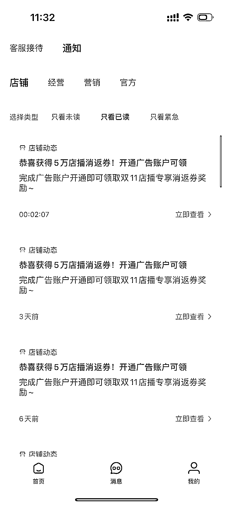
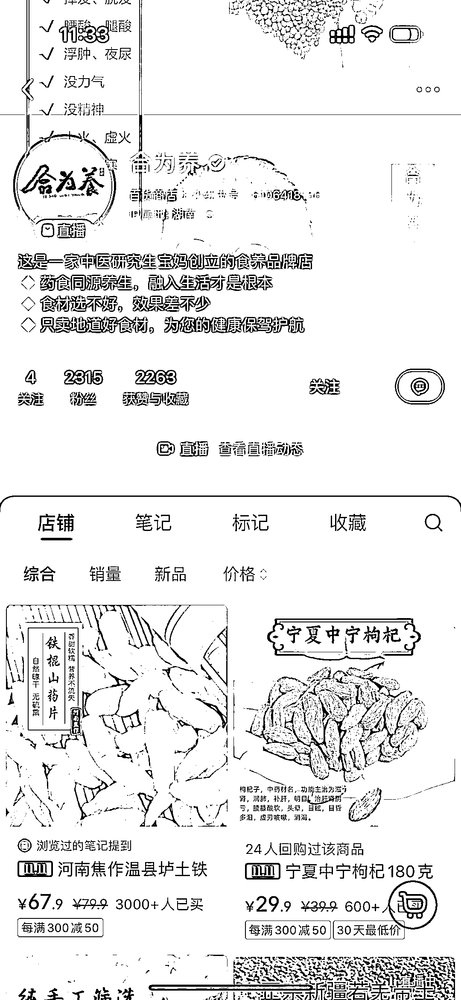

# 小红书电商平台发展迅猛，医药相关店铺销售额飙升

> 原文：[`www.yuque.com/for_lazy/xkrm14/smty44pbegb16zy7`](https://www.yuque.com/for_lazy/xkrm14/smty44pbegb16zy7)

作者： Vivi|每日成长 *

日期：2023-10-24

点赞数：**65**

* * *

正文：

小红书在大力发展电商，有货源、有好货的圈友可以赶紧冲一波了。
后台不断给博主发开通店铺营销消息。有一个粉丝 2000 左右，但是直播带货中医药相关的店铺，新号起号已经有 6 位数的营业额了，增长迅猛。

* * *

评论区：

苗小羊 : 这种产品如何上架呢？

William.L : 这个店铺的创始人我认识，她自己的大号在直播带这个品牌的货，本质上是大号的势能拉起来的

Vivi|每日成长 * : 嗯嗯 这个博主我也追了很久，大号拉起来，现在店铺不断，其他主播在播 也很厉害

Vivi|每日成长 * : 开通企业店铺 按照类目上架就可以

Vivi|每日成长 * : 谢谢亦仁大大！

* * *

公众号懒人找资源，懒人专属群分享