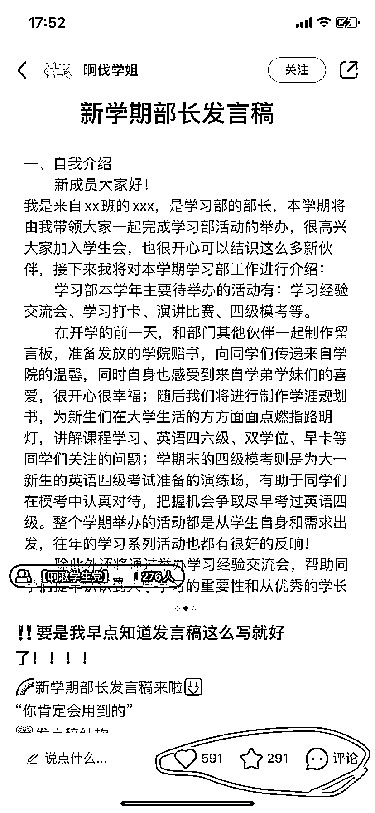

# 大学学生会细分赛道，AI 生成内容助力引流和组织策划

> 原文：[`www.yuque.com/for_lazy/xkrm14/hgwnnbcntab21r10`](https://www.yuque.com/for_lazy/xkrm14/hgwnnbcntab21r10)

作者： 飞掌柜

日期：2023-10-20

点赞数：**94**

* * *

正文：

针对大学的学生会细分赛道，可提供学生会规章制度、主席发言稿、部长发言稿、活动组织策划等，其实内容都可用 AI 生成，基于网上已有的资料喂数据，可引流学生加群、私信。

* * *

评论区：

毕 : 这类是靠资料整理赚钱吗？

飞掌柜 : 主要是引流，赚钱模式可以沉淀到私域

飞掌柜 : 感谢老大

毕 : 谢谢

漫漫 mansi : 来个联系方式，资源互换

希平 : 学生很多白嫖的[大哭][大哭][大哭]

* * *

