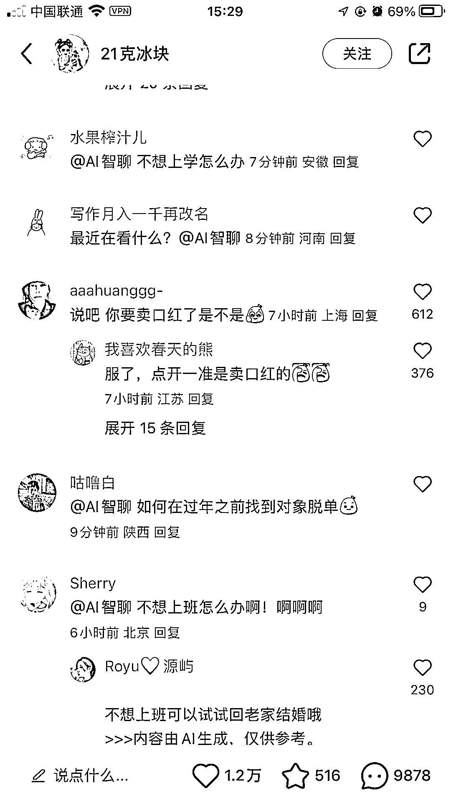

# 小红书推出 AI 智聊功能，助力增加评论数量

> 原文：[`www.yuque.com/for_lazy/xkrm14/gpmh4757s77ogeum`](https://www.yuque.com/for_lazy/xkrm14/gpmh4757s77ogeum)

作者： 惠玲

日期：2023-10-25

点赞数：**59**

* * *

正文：

小红书想增加评论数量的看过来 一种很新的玩法 这个 AI 智聊不确定是个人在弄还是小红书官方在弄啊，但是能提高评论数量。很吸引人。

* * *

评论区：

重楼 : 没太懂，这种除了涨粉之外怎么变现呢？

小光 : 我去看了下这个号评论区，说实话没看懂是为什么会这么多评论

* * *

公众号懒人找资源，懒人专属群分享