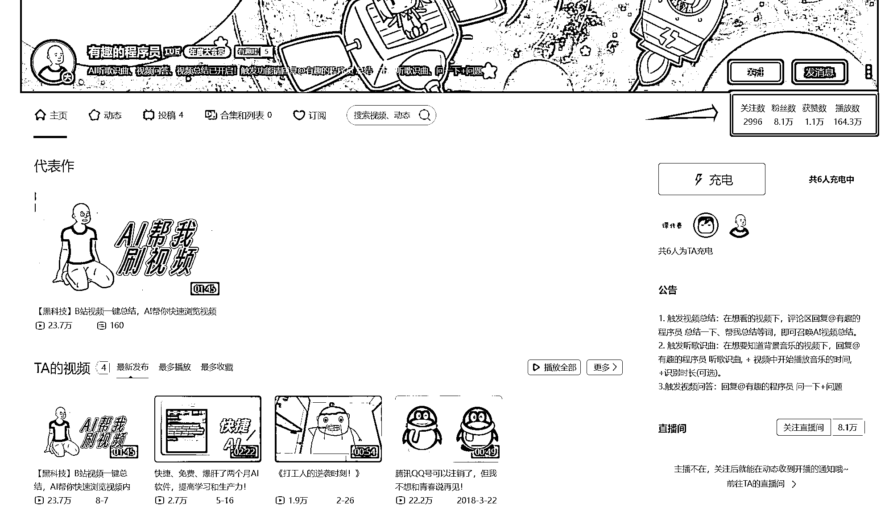

# AI 视频总结帐号在 B 站引爆热潮，8.1 万粉丝追捧

> 原文：[`www.yuque.com/for_lazy/xkrm14/vcgf0buhuoqm3lcg`](https://www.yuque.com/for_lazy/xkrm14/vcgf0buhuoqm3lcg)

作者： 珞珈 Lorjia

日期：2023-10-26

点赞数：**45**

* * *

正文：

刷到 B 站一个帐号很有意思，利用 AI 总结视频，只有 4 条视频，却有 8.1 万粉丝 帐号主要有以下功能： 1.
触发视频总结：在想看的视频下，评论区回复@有趣的程序员 总结一下、帮我总结等词，即可召唤 AI 视频总结。 2.
触发听歌识曲：在想要知道背景音乐的视频下，回复@有趣的程序员 听歌识曲, + 视频中开始播放音乐的时间, +识别时长(可选)。
3.触发视频问答：回复@有趣的程序员 问一下+问题

* * *

评论区：

能量菌 : 小红书也有@AI 智聊

城市隐者 : 只能在博主视频下@才有用

* * *

