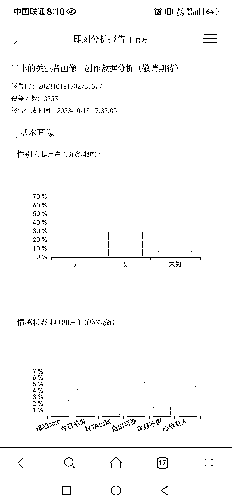
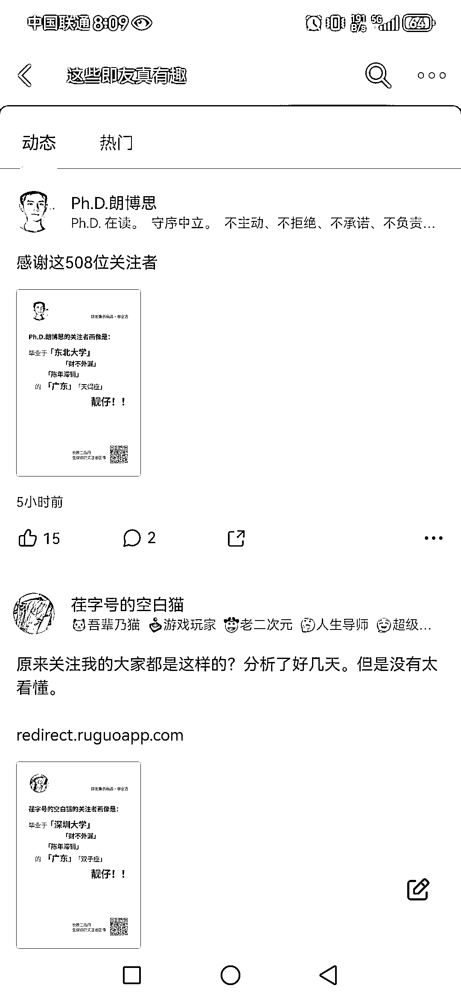

# 新 AI 工具帮助分析粉丝画像，即友们纷纷排队等候

> 原文：[`www.yuque.com/for_lazy/xkrm14/qhuy3e93x2mg48pd`](https://www.yuque.com/for_lazy/xkrm14/qhuy3e93x2mg48pd)

作者： 珞珈 Lorjia

日期：2023-10-26

点赞数：**44**

* * *

正文：

即刻上一位即友做了一款分析粉丝画像的 AI 工具，挺有意思的，但是需要关注量＞500 的即友才能生成
很多即刻大佬都在圈内分享了各自的粉丝画像，而且还有很多用户正在排队中… 第一次免费生成，第二次@机器人后，需要给机器人的动态回复打赏才能付费💰生成报告

* * *

评论区：

书情小跟班 : 不错啊

* * *

公众号懒人找资源，懒人专属群分享