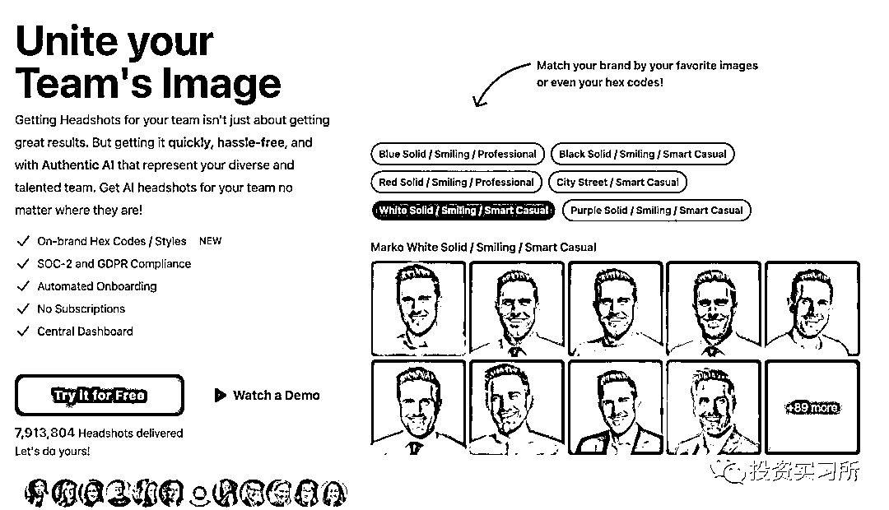

# 苹果前员工开发的 AI 修图产品 Secta Labs，一年内突破百万美元 ARR

> 原文：[`www.yuque.com/for_lazy/xkrm14/ootgrgbgux42uk1w`](https://www.yuque.com/for_lazy/xkrm14/ootgrgbgux42uk1w)

作者： 老张唠 AI

日期：2023-10-23

点赞数：**41**

* * *

正文：

苹果前员工做的 AI 修图类产品 Secta Labs，产品发布不到一年时间 ARR 也已经突破了 100 万美金，其客户数量还不到 2.2 万。
将你自拍的照片通过 AI 处理后，给你输出大量不同风格的头像，只不过它输出的头图非常职业化，偏向于职场里需要的专业人士风格，因此它更多是一个面向 B
端的产品，你建立账号后它就已经给你开通了团队账户。

* * *

评论区：

闲富咨询【软件商业】 : 讲真话 这个生意 挺不错 都是精英再用 天然传播

* * *

