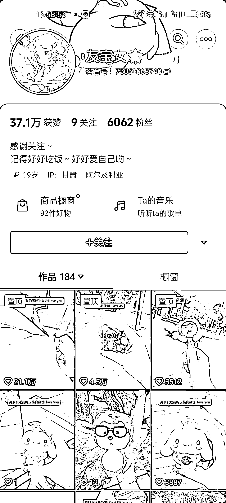
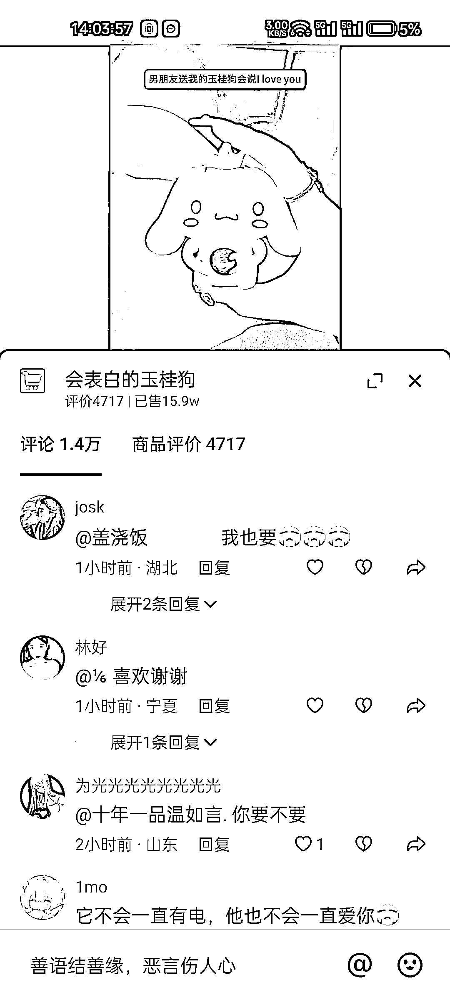

# 八、秒视频创造百万销售，风向标指引新营销方式

> 原文：[`www.yuque.com/for_lazy/xkrm14/zylzrbtlw5ohdx2u`](https://www.yuque.com/for_lazy/xkrm14/zylzrbtlw5ohdx2u)

作者： 佰亮

日期：2023-10-16

点赞数：**146**

* * *

正文：

6000 粉丝，一条 8 秒视频卖了 100W。 爆点总结： 1，视频拍摄形式新颖，从口袋里拿出来，给观众悬疑感和期待感 2，产品绑定社交因素（男朋友买）
3，互动率高，评论区男生在@女朋友要不要，女生在@男朋友买一个 4，9.9-13.9 的价格容易造成冲动消费 5，产品新奇特

* * *

评论区：

易木水道 : 请问图 2 是哪里看的

佰亮 : 巨量百应

程序员八两 : 这个数据好像是全平台的销售额，不是一个人的商品橱柜？

字节叔叔 : 刚刚看这个博主这个品的销量是 17.4w

阿黎 : 这个很可以

佰亮 : 抱歉，刚刚和客服确认了一下，是商品类目的销售额，不是这一条视频的

佰亮 : 抱歉，刚刚和客服确认了一下，是商品类目的销售额是 100w+，不是这一条视频的

* * *

公众号懒人找资源，懒人专属群分享