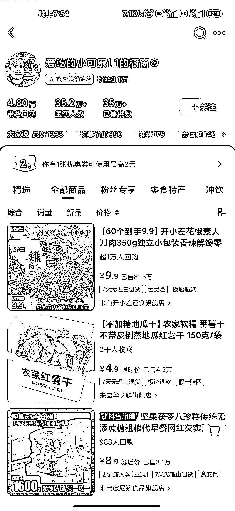
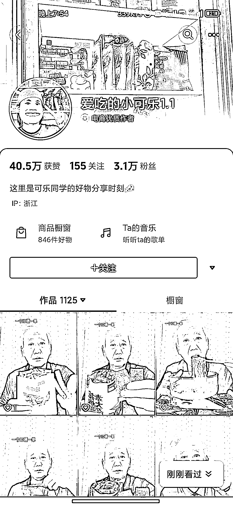

# 中老年人卖出 35w 件零食，展现普通人的优势

> 原文：[`www.yuque.com/for_lazy/xkrm14/qvpi72wbqi8tmh9g`](https://www.yuque.com/for_lazy/xkrm14/qvpi72wbqi8tmh9g)

作者： 迭一休

日期：2023-10-20

点赞数：**137**

* * *

正文：

一个中老年人，搭配着评论区调侃的截图，吃零食，卖了 35w 件 接地气和反差感，真是普通人的优势呀

* * *

评论区：

艾小飞 : 主打的是价格低才有这种优势

张日 : 虽然是低价，最近 30 天的销售额也是 10-25 万哟，卖的最好的是 9.9 元的花椒素大刀肉

展东 : 我记得是老人特效吧。

迭一休 : 也有可能，我第一感觉也是，但是太真实了

iiiiMG : 不是可能，就是特效。

顾奇 : 变脸特效

花天卓 : 一天发十几条，牛

* * *

