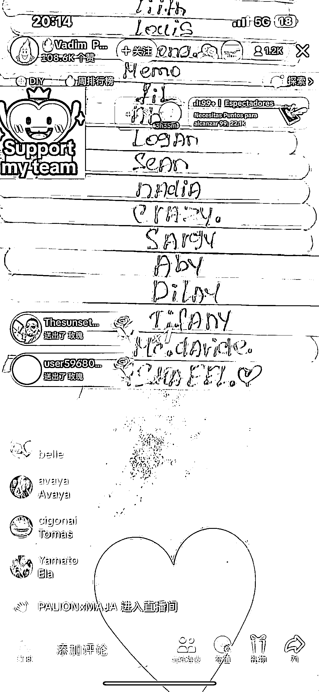
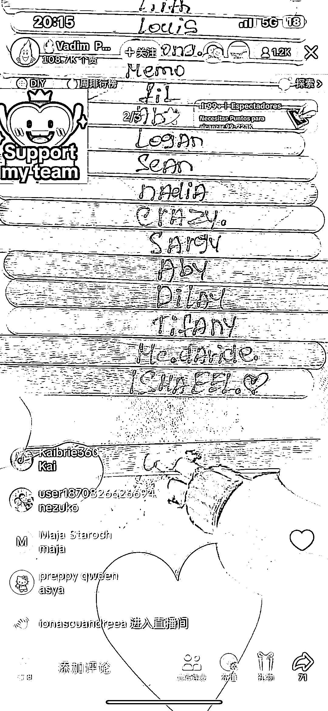
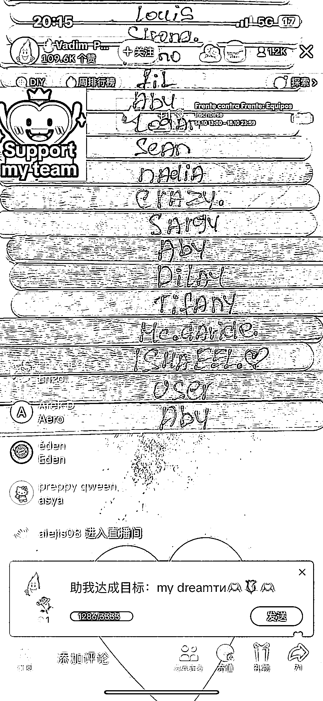

# 意大利主播通过木板写名字赚取高额收入

> 原文：[`www.yuque.com/for_lazy/xkrm14/sewaqofi06uzl682`](https://www.yuque.com/for_lazy/xkrm14/sewaqofi06uzl682)

作者： 郭小帅

日期：2023-10-17

点赞数：**77**

* * *

正文：

看到一个很有意思的主播，意大利人，木板上写名字，一朵玫瑰写一个，多送就加个爱心，基本没断 偶尔说说话就是感谢，一朵玫瑰 0.01 €，一晚上 100
多€了，去掉成本也不错啊，要是字写的再好看点就更加分了

* * *

评论区：

能量菌 : 这个是啥笔？

郭小帅 : 貌似是插电能加热的…

能量菌 : 嗷嗷

金九渊 : 国内也有，签名直播间

国强，坐标日本 : 搞起来！

才 : 电容笔加雪糕棍？

郭小帅 : 对

* * *

公众号懒人找资源，懒人专属群分享