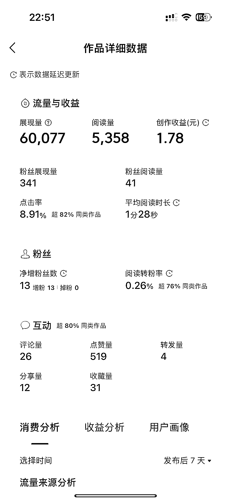
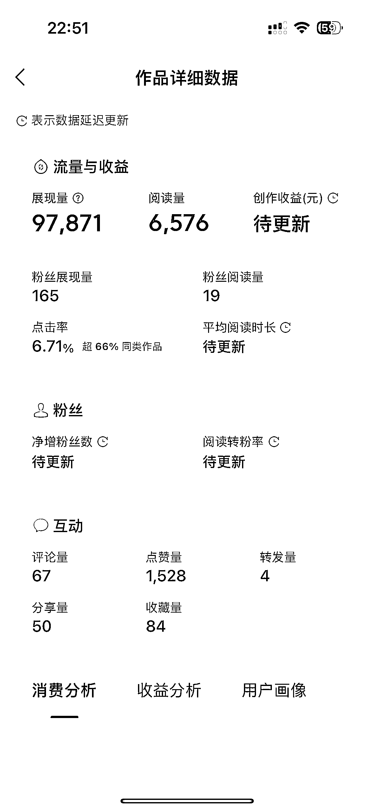
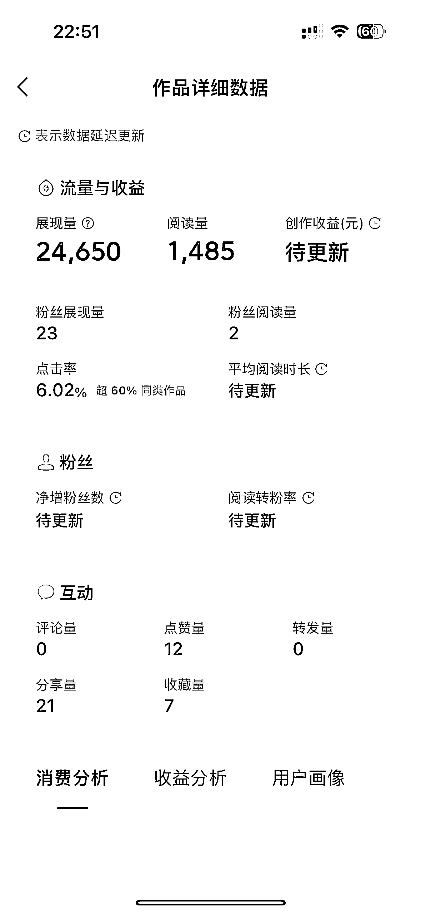

# 创意打油诗，以｛ ｝为主题，反转开头，积极向上吸引读者互动

> 原文：[`www.yuque.com/for_lazy/xkrm14/mpkeu8cndzkzg31g`](https://www.yuque.com/for_lazy/xkrm14/mpkeu8cndzkzg31g)

作者： Y024

日期：2023-10-16

点赞数：**74**

* * *

正文：

微头条创作的 2 个好用提示词： 1.请以｛ ｝为主题进行打油诗创作，开头要有反转，内容要积极向上，吸引读者互动。 2.请以｛
｝为主题进行白话文创作，开头要有反转，内容要积极向上，吸引读者互动。 打油诗、白话文都是受众更能接受的体裁，适合头条用户群体，基本可以有个 60
分以上的内容，加上好的主题、图片，能取得不错的效果。

* * *

评论区：

Y024 : 以前觉得发风向标有点难，现在发现其实是没实战。😂 入场折腾，总会有信息碎片汹涌而出，忍不住咔咔咔一顿水风向标。[捂脸]

* * *

