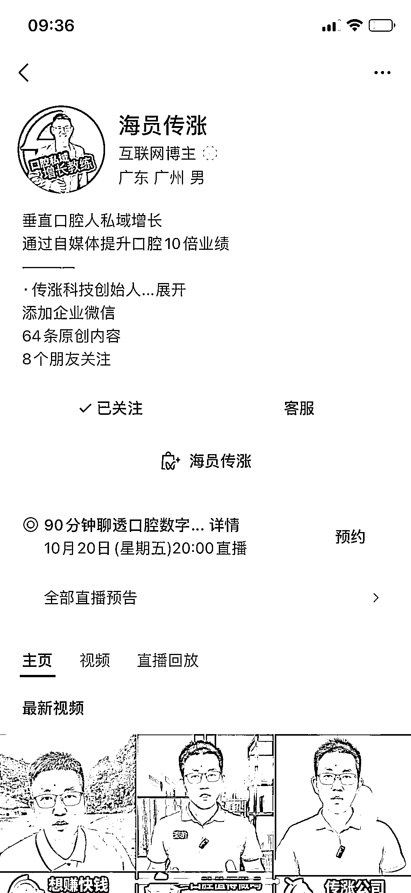

# 口腔私域传涨聊：个人 IP+内训+客户转介绍，创业者分享成功经验

> 原文：[`www.yuque.com/for_lazy/xkrm14/kyw8qyoeptihx3r1`](https://www.yuque.com/for_lazy/xkrm14/kyw8qyoeptihx3r1)

作者： 嘉应岛主

日期：2023-10-16

点赞数：**61**

* * *

正文：

今天找了 2020 年开始做口腔私域的传涨聊： 1.他们的飞轮是做好个人 Ip+给口腔做好内训和私域+客户转介绍
2.他的创业开始是：给一家口腔门店做私域，一个月收 5000 元一周去两次，三个月做到 30W 私域增长拿 10％的分成。验证私域模型可行，找口腔医院做内训，然后是内训+3W 的全年私域教练陪跑。目前累计做到了 60 家。
3.他从 2016 年就开始进入口腔，一直到现在，积累的口腔行业资源多，对口腔医生创业的用户比较了解。
4·他六成用户其实是从 2020 年做 Ip 视频号来的牙医，有四五万用户!!! 如果你有行业积累，想做 Ip，很适合视频号

* * *

评论区：

墨北 : 飞轮？是什么😄

嘉应岛主 : 最近企业喜欢提飞轮，就是能够成长的企业核心点

张小厨 : 互联网几年前的增长获客逻辑，增长飞轮；属于增长黑客范畴

嘉应岛主 : 对✓

* * *

