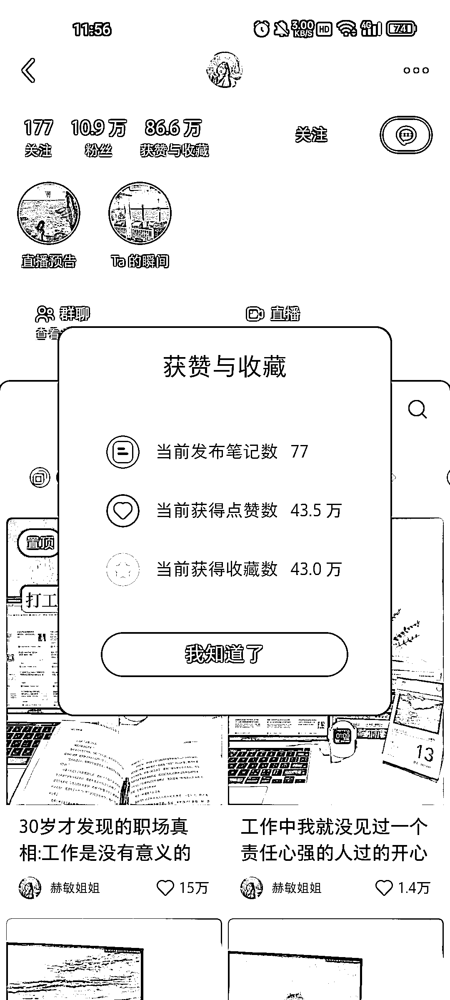

# 女性职场博主分享职场干货、求职面试技巧和工作工具

> 原文：[`www.yuque.com/for_lazy/xkrm14/ff3f02uffs1ox5g3`](https://www.yuque.com/for_lazy/xkrm14/ff3f02uffs1ox5g3)

作者： Choco

日期：2023-10-20

点赞数：**70**

* * *

正文：

女性职场博主，关键词：女性+职场。主要分享职场干货，女性成长，求职面试，以及工作中可以用到的新工具。
变现：职场工具类的广告，求职面试的技巧，女性个人成长陪伴营，职场遇到的问题怎么解决，知识星球，1v1 定制指导，职场穿搭，谈判技巧，因为就光职场上就有很多可以分享

* * *

评论区：

倪大胖 : 很红海

艾小飞 : 可以在红海中找到细分需求点，也可以成蓝海的

溪希 : 这个作者在即刻有一些做帐号的记录和数据，可以了解更多。

希平 : 这个很重要，能拿到一手数据源

* * *

