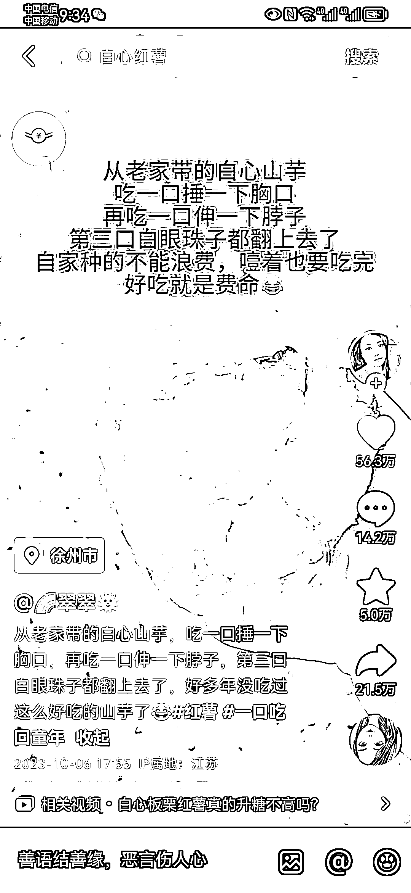
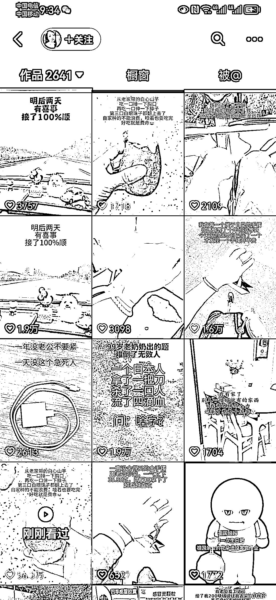
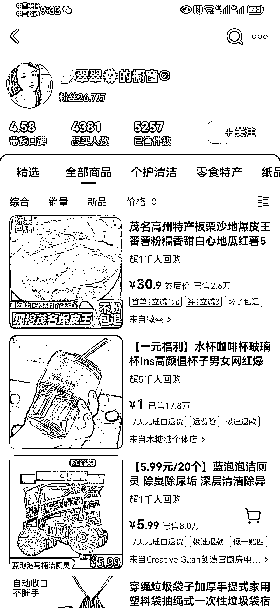
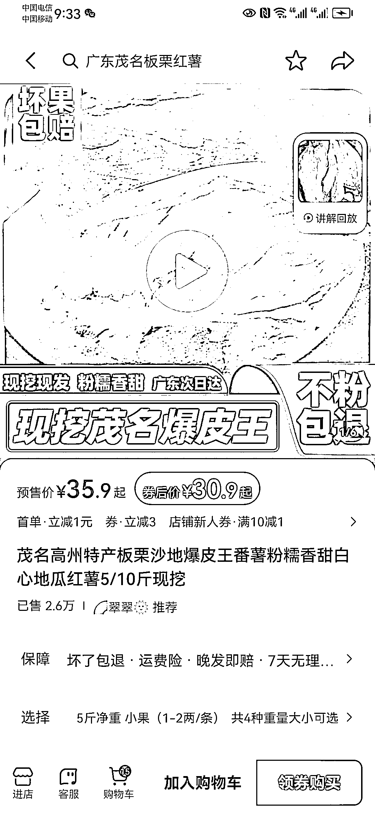

# 文案与画面相结合，引发共鸣的带货账号

> 原文：[`www.yuque.com/for_lazy/xkrm14/vle7pp7tefbg2h23`](https://www.yuque.com/for_lazy/xkrm14/vle7pp7tefbg2h23)

作者： 胖大玲

日期：2023-10-20

点赞数：**56**

* * *

正文：

这种以文字为主导画面的账号，其实已经不新颖，但新颖的是：他的文案写的很巧妙（很接地气的阐述了产品使用的感受）一个账号里面会隔三差五的拍产品，不同的角度配上这相同产品使用感受的文案，这很容易引起共鸣，而且每条流量都不错。
这条风向标想表达的意思是：带货的小伙伴，可以在产品的使用感受上面多下文案功夫，尽可能接地气，视频内容可以从产品多角度拍摄，同一条文案，然后狂怼作品！
【变现方式】：自己选品，或者带跟他相同的产品，用他这条文案，直接狂怼作品，反正数据已经测出来了[捂脸][捂脸]

* * *

评论区：

胖大玲 : 谢谢大大💪 💪

能量菌 : 简单粗暴的描述心里感受，直击人心

胖大玲 : [强][强]

* * *

公众号懒人找资源，懒人专属群分享