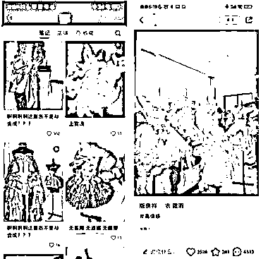

# 利用瑕疵品和微瑕吸引流量，适用于图书和临期食品

> 原文：[`www.yuque.com/for_lazy/xkrm14/rwayi8xpdsczqc6v`](https://www.yuque.com/for_lazy/xkrm14/rwayi8xpdsczqc6v)

作者： 偏执狂

日期：2023-10-20

点赞数：**61**

* * *

正文：

加上【瑕疵品】【微瑕】之类的词，流量就比平时高很多。微瑕自带流量体，另外可运用到图书、绘本上面，这种瑕疵大部分人都能接受。还可延伸到临期食品上面。

* * *

评论区：

艾小飞 : 我正在做你这其中之一的项目

* * *

