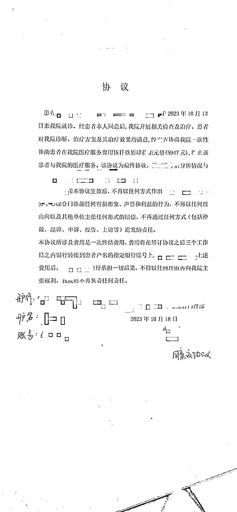
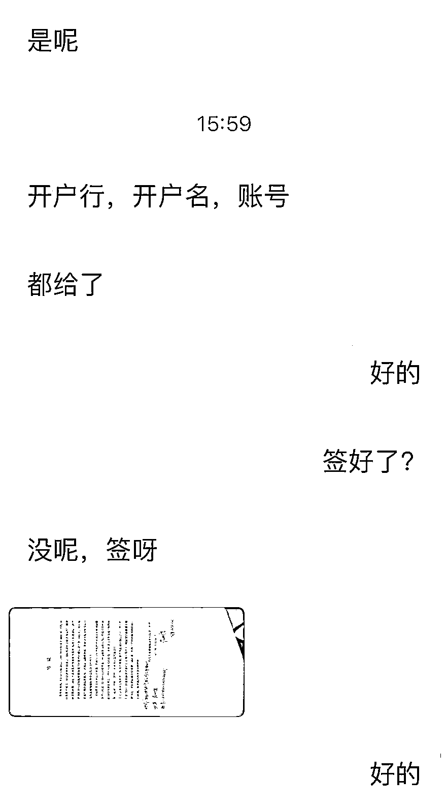
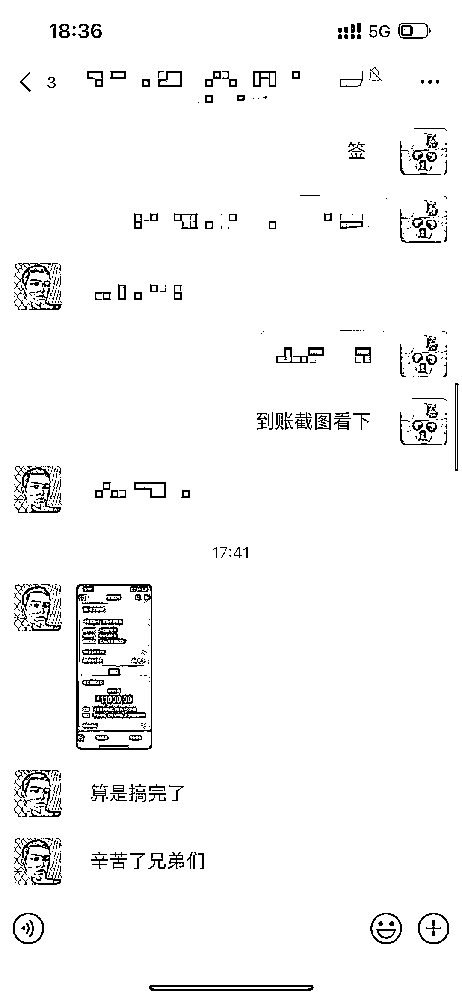

# 教人讨钱也是个发财好生意

> 原文：[`www.yuque.com/for_lazy/xkrm14/md1rrpl15vrqucga`](https://www.yuque.com/for_lazy/xkrm14/md1rrpl15vrqucga)

作者： 子白

日期：2023-10-24

点赞数：**56**

* * *

正文：

想赚钱就做离钱近的事儿，比如“教人赚钱”一直是好生意。今天咱们换个思路，“教人讨钱”也很发财。 受
大佬的精华帖启发，既然教育机构退费是刚需，那么其他机构退费是不是刚需？我也去试了试，果然可行。

* * *

评论区：

洋先生 : 医疗美容行业退费，我们在做的，确实可观[偷笑]

周宇 : 优秀

佐敦道 : 远程操作的还是要去实地

子白 : 线上指导

佐敦道 : 我们和客户还签订合同么？有没有合同范本。

佐敦道 : 你们和客户还签订合同么？有没有合同范本。

Jay : 可以加好友请教一下嘛

* * *

