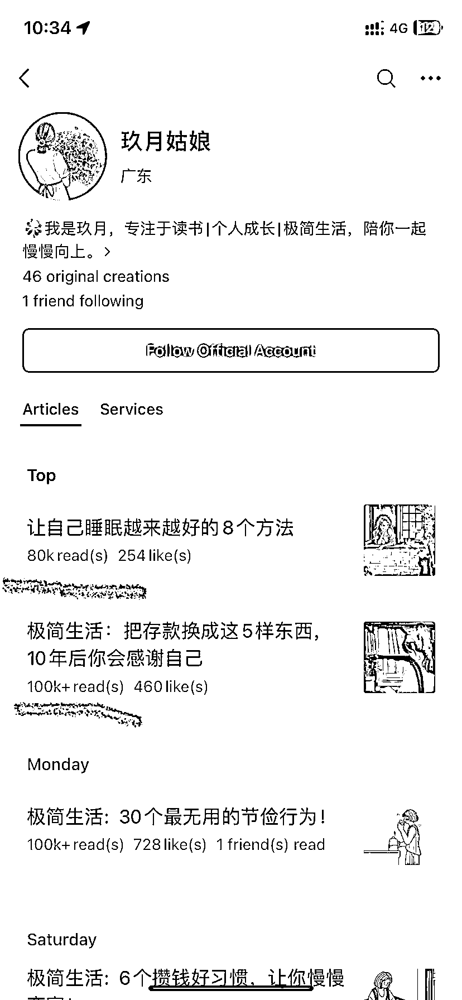

# 极简生活方式在公众号上的流量表现不错

> 原文：[`www.yuque.com/for_lazy/xkrm14/vt1ukqzp1dd5hex4`](https://www.yuque.com/for_lazy/xkrm14/vt1ukqzp1dd5hex4)

作者： 呀啦啦呼

日期：2023-10-26

点赞数：**79**

* * *

正文：

做极简内容的伙伴们可以参考下 这类题材在公众号上流量还是很大 而且很容易被点在看 很符合现在消费降级的大趋势 每天分享一些极简生活的方式
这类题材小红书、抖音等很多 只要做些整合用简单的文字表达出来即可

* * *

评论区：

能量菌 : 简单才是极致

呀啦啦呼 : 感谢亦仁大大

* * *

公众号懒人找资源，懒人专属群分享