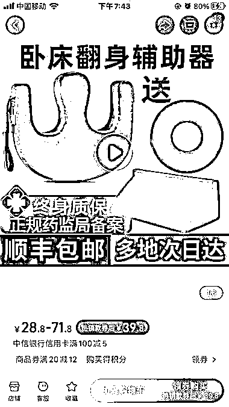

# 老年人翻身辅助器，解决翻身难题，预防褥疮

> 原文：[`www.yuque.com/for_lazy/xkrm14/he7si411tu0wtdly`](https://www.yuque.com/for_lazy/xkrm14/he7si411tu0wtdly)

作者： 星辰

日期：2023-10-26

点赞数：**70**

* * *

正文：

再推荐一个老年人用品，翻身辅助器。
家里如果有失能老人的，翻身是一个大难题。老人长期一个姿势躺着，可能会的褥疮，但是翻身如果弄不好，可能会扭伤老人，所以需要这个辅助器，一般医院的护工都会用到。有时候还需要搭配三角垫。
这些东西成本都极低，利润高。

* * *

评论区：

你白 : 这个产品我卖了三年[呲牙]

星辰 : 你是厂家么？还是厂家当地拿货的？

书情小跟班 : 不错

* * *

