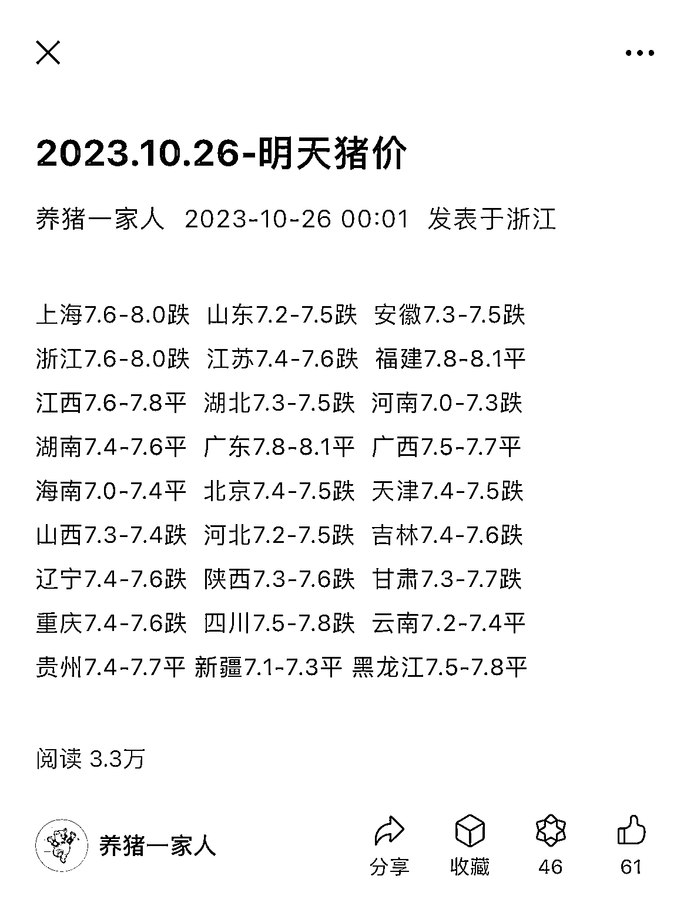

# 猪肉价在流量中表现突出，几个账号每日流量 3w+

> 原文：[`www.yuque.com/for_lazy/xkrm14/kaopi2ezp9b19h8u`](https://www.yuque.com/for_lazy/xkrm14/kaopi2ezp9b19h8u)

作者： 榛子（小梦）

日期：2023-10-26

点赞数：**71**

* * *

正文：

对比牛肉价、鸡蛋价，猪肉价的流量还挺大的，找到几个账号每日流量 3w+，图 1、2 赚底部流量，图三赚文中广告+底部流量，内容制作上面也是很简单，可以学习下，思路打开，菜价
玉米价…

* * *

评论区：

小新 : 他是在哪里统计这个价格的？

榛子（小梦） : 一些行业网站呗

* * *

公众号懒人找资源，懒人专属群分享