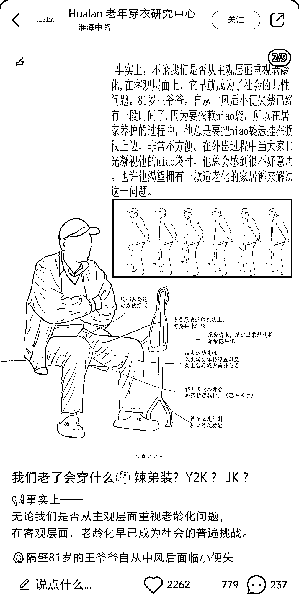
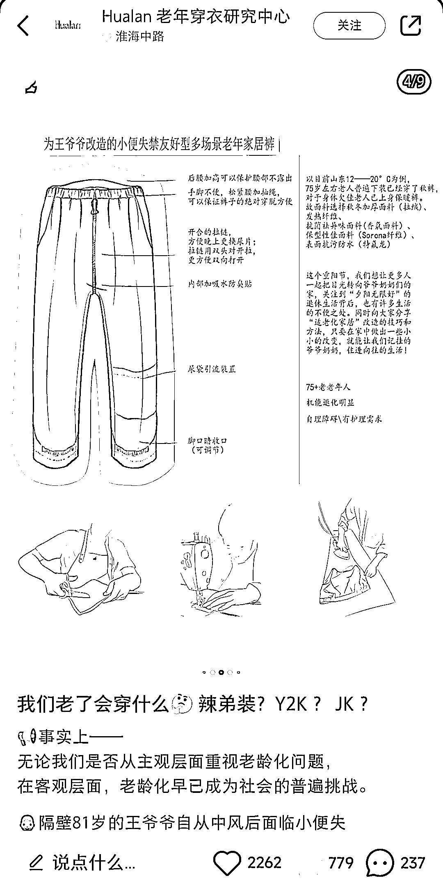
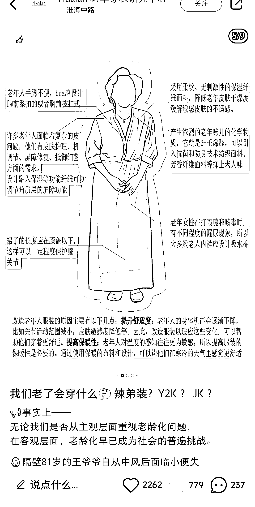
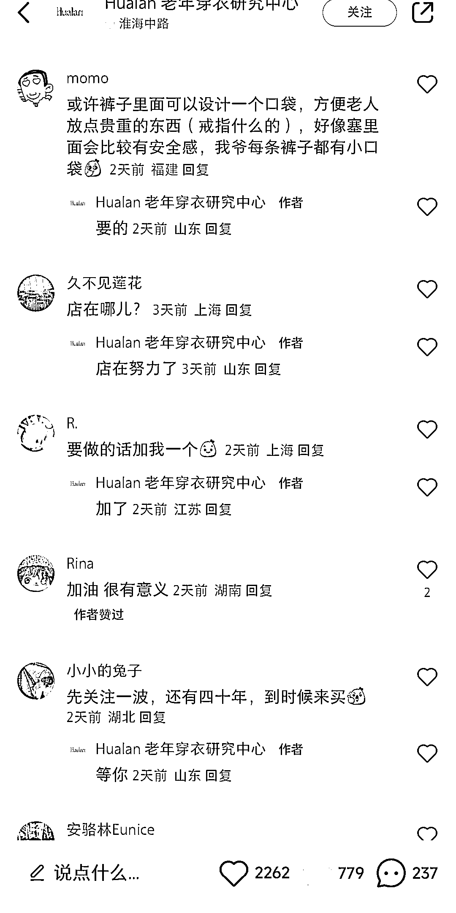
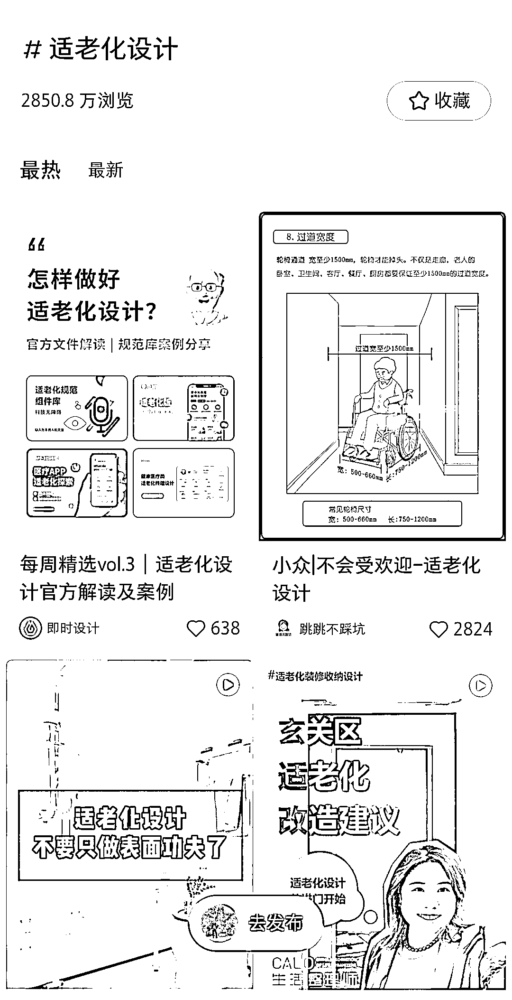

# 适老化服装设计：关注老年人需求的新热潮

> 原文：[`www.yuque.com/for_lazy/xkrm14/zdoaguo3geh0fzmt`](https://www.yuque.com/for_lazy/xkrm14/zdoaguo3geh0fzmt)

作者： Jay

日期：2023-10-27

点赞数：**128**

* * *

正文：

适老化服装设计，通过几张图片，阐述设计的细节，针对不同疾病或者不同需求的老年人对服装进行改造，评论区有兴趣或者有需求的人很多，甚至还有想投资的
小红书关于关爱老人的话题标签有 9.5 亿热度，适老化设计标题 2850 万，适老化的设计，居家改造都有很高的关注量，越来越多的年轻人开始关注老年人的需求，愿意为家中老年人的生活质量进行提高和改善，同时也为自己的老后生活做打算

* * *

评论区：

有尔 : 太酷了

胡洋 : 牛啊[强]，这是积功德的事

书情小跟班 : 不错啊

若水～ : 小红书的话题标签在哪里可以看到

武雨菲 : 厉害

Jay : 通过点击笔记下面的 tag 标签

CC : 这个好赞

* * *

