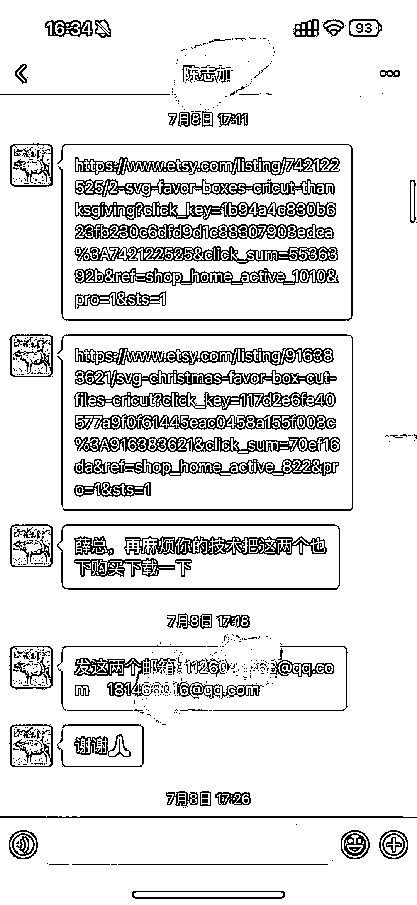
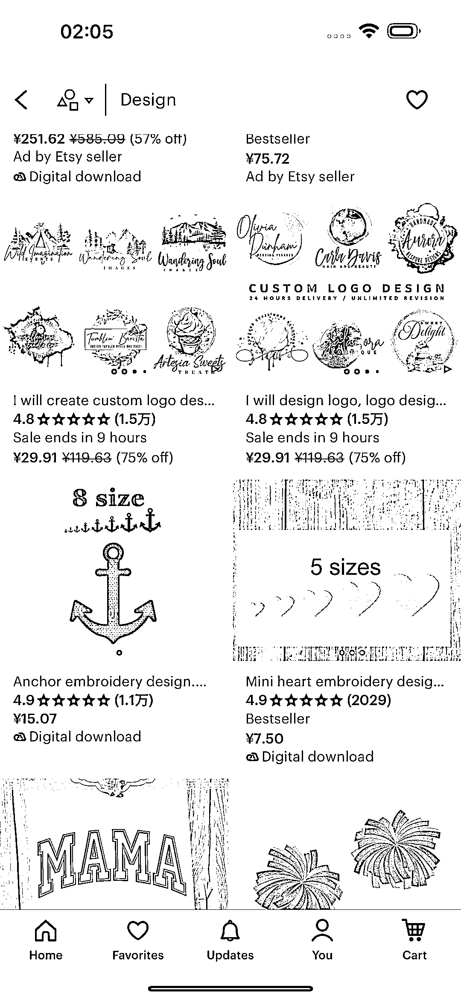

# 通过 Etsy 有效方案，企业主节约成本并获得爆品设计方案

> 原文：[`www.yuque.com/for_lazy/xkrm14/mu8so6rgl6n2hzdg`](https://www.yuque.com/for_lazy/xkrm14/mu8so6rgl6n2hzdg)

作者： 老薛

日期：2023-10-25

点赞数：**57**

* * *

正文：

ETSY 信息差 很多企业工厂的老板，需求得到一个理想设计方案，如果请你设计师，需要耗费大成本。
将请设计师的成本去购买 Etsy 已经被验证过的有效方案，一来容易出爆品，二来节约了大量时间成本。 对于绝大多数设计师就开始从这里找到解决方案。
把方案优化卖给企业主。 衍生出了，带买服务，深度看了一下，产值很高，
而更高的是，PDD 买回来拆开，再批量上架的中国卖家，有店群已经做到了月入比较漂亮的 7 位数利润。 总结 1.代买，2.优化方案。3 开店群批量上新。

* * *

评论区：

老薛 : 666

Javinlee : pdd 那一段话的意思是 采购国外产品上架到 pdd 做店群？

老薛 : PDD 下载，细分做好发布 ETSY

Javinlee : 好角度👍🏿

西昂 : 这个用途是啥呢？产品上的图？

老薛 : 可以理解为 DPP0.99 人民币买来的素材，然后放到 ETSY，1.99 美金卖出，一本万利，并可以挂机自动出售

Kevin 的 etsy* : 感谢分享 这个思路很棒

* * *

