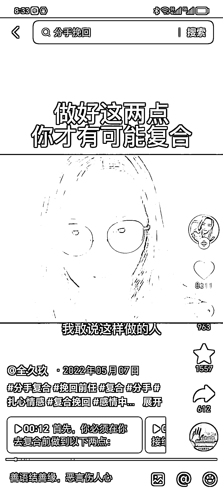

# 情感挽回成为热门赛道，年轻女生愿意付费咨询并参加情感成长课程

> 原文：[`www.yuque.com/for_lazy/xkrm14/ym113ypzh4l1s5b5`](https://www.yuque.com/for_lazy/xkrm14/ym113ypzh4l1s5b5)

作者： 蚂蚁快跑

日期：2023-10-26

点赞数：**58**

* * *

正文：

情感挽回一个非常好的赛道，每天有大批量的 00 后，年龄在 20 多岁上下的小女生在各处询问如何挽回，如何复合，是不是正缘之类的问题，其中有 20%的人为此愿意付出 99-999 元的咨询费，如果嫁接上类似坏男孩之类的情感成长技巧类课程，简直不要太爽了。

* * *

评论区：

小花 : 挽回是情感赛道最痛点的需求。但是情感也很容易违规。

艾小飞 : 对，小红书上一片骂声

* * *

