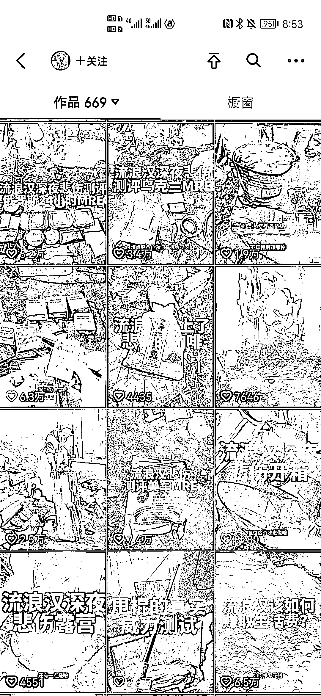
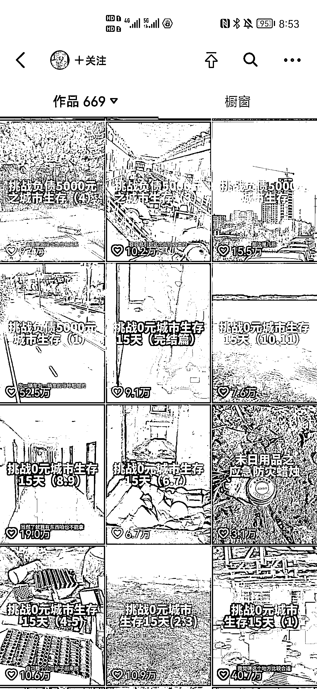

# 低成本生存系列视频引发关注，主打陪伴

> 原文：[`www.yuque.com/for_lazy/xkrm14/wcsb7632k3ov07gl`](https://www.yuque.com/for_lazy/xkrm14/wcsb7632k3ov07gl)

作者： 希平

日期：2023-10-27

点赞数：**64**

* * *

正文：

拍摄低成本生存系列，主打陪伴 刚刚发现一个有趣的抖音账号，叫做杀心成焚。 流量：通过低成本生存系列的视频，比如流浪汉、0 元城市生存等（图 1 图 2）。
转化：从精选联盟来看，一个月的销售额是 5 万左右（图 4），主要是通过视频跟直播去带货，视频基本是上万赞甚至几十万，直播间一直稳定在 4 万人。
需求：从评论区进入粉丝主页来看，基本是男性，年龄从 16-40 岁。
无独有偶，如米修玩大了发了几篇大学生社会生存法则（图 5），这背后则是大学生就有环境不好，然后怎么在一个大城市的低成本去生存，成了一个非常活跃的话题。

* * *

评论区：

玩陀螺的 : 这博主全网粉丝很多的，不能只从抖音数据看

希平 : 全网？你指的是抖音加上西瓜视频，再加上今日头条，是吧？

玩陀螺的 : …知乎，B 站不会搜一搜么？

希平 : 那个，我只是问你全网指的是什么。。。

AQ : 他的意思是这个博主不是小白博主，可能其他平台已经有粉丝积累了。知乎微博等等都可以看看。

金九渊 : 这个博主主要是出现在抖音人生规划四杰里面。 评论区画风： 1.顺风张雪峰，逆风暴叔，绝境杀心成焚 2.雪峰吃操作 吉田吃意识 暴叔吃经济
张雪峰核心装备：志愿填报书 吉田哥核心装备：专升本证书 暴叔的核心装备：资产证明书 张雪峰：选专业 吉田：选学校 暴叔： 选国家

* * *

