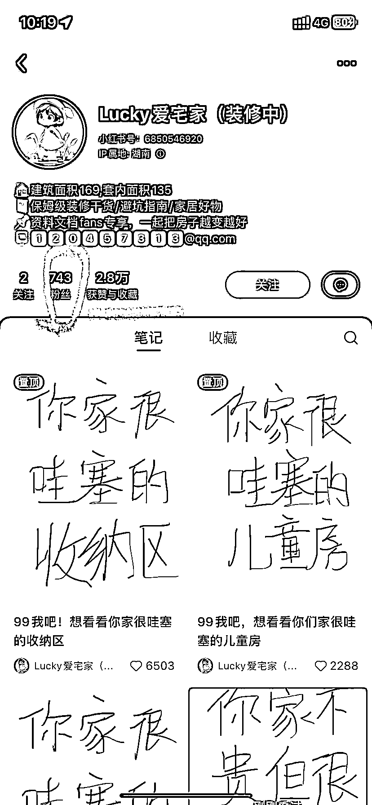

# 家装账号起号方式值得借鉴，干货分享引发互动高赞评论

> 原文：[`www.yuque.com/for_lazy/xkrm14/ni9qg70kpo416qyw`](https://www.yuque.com/for_lazy/xkrm14/ni9qg70kpo416qyw)

作者： 呀啦啦呼

日期：2023-10-26

点赞数：**46**

* * *

正文：

这个家装的账号起号方式值得借鉴 做室内装修的朋友可以参考 博主主打一个刚毕业要装修新房的人设 最开始分享一些干货评论区互动不强
后来通过图一二这些互动性强的帖子成功起号 低粉高赞 评论区全部都是自家各种装修风格

* * *

评论区：

呀啦啦呼 : 感谢亦仁大大

* * *

公众号懒人找资源，懒人专属群分享