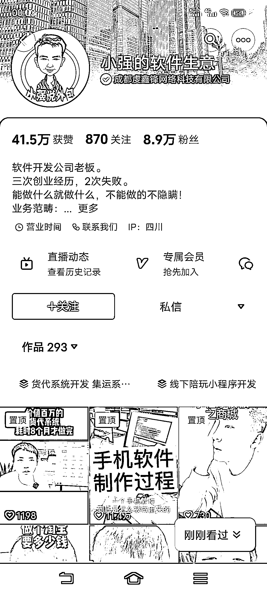

# 2B 业务免费流量引流的破圈宣传方式

> 原文：[`www.yuque.com/for_lazy/xkrm14/xn3t09y7fag3y3az`](https://www.yuque.com/for_lazy/xkrm14/xn3t09y7fag3y3az)

作者： 默默在学习

日期：2023-10-26

点赞数：**43**

* * *

正文：

2B 业务怎么做免费流量引流？ 刚刷到一个做软件定制的账号，新出的两条视频火爆出圈。 软件定制一般宣传无非是讲技术，讲质量，讲服务，但是这类内容注定没流量。
这个账号出圈的作品，定制一个 12306 需要多少钱？定制一个高德需要多少钱？ 内容大家所有人都用，又结合了自己的业务范畴，完美实现了免费流量宣传小众冷门业务。
所有冷门或者传统行业的，都可以考虑这种破圈宣传方式，一定要放弃产品思维，打磨自己的流量思维。

* * *

评论区：

能量菌 : 产品思维→流量思维

* * *

公众号懒人找资源，懒人专属群分享