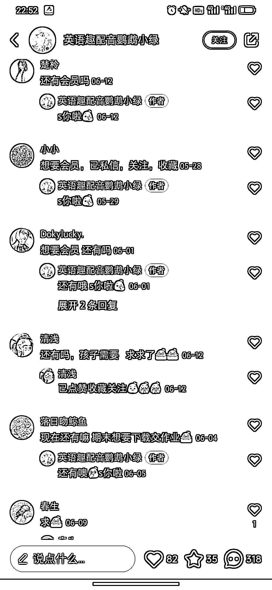
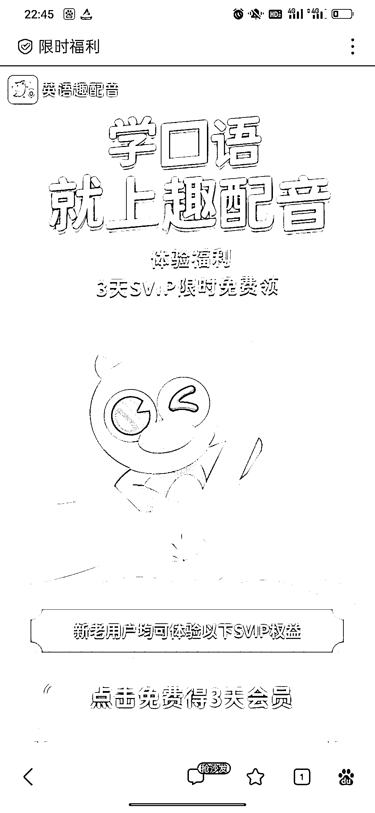
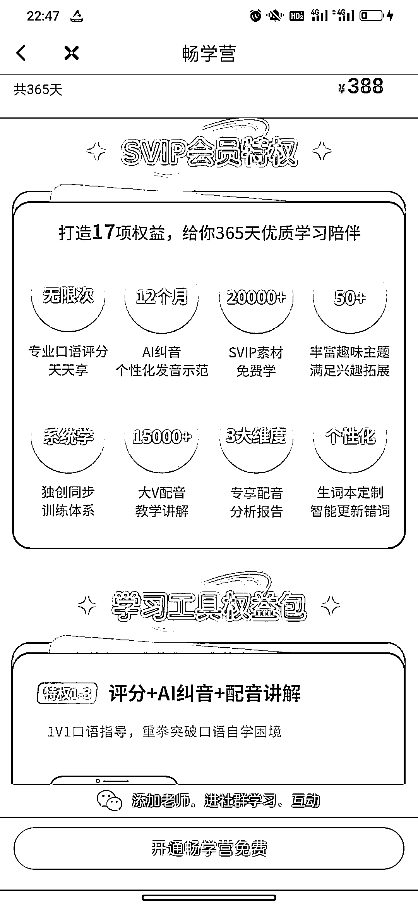

# 趣味英语 APP，西游记配音，代入感强，摆脱哑巴英语

> 原文：[`www.yuque.com/for_lazy/xkrm14/on7zc78hfo6br73f`](https://www.yuque.com/for_lazy/xkrm14/on7zc78hfo6br73f)

作者： かサゼ

日期：2023-10-24

点赞数：**34**

* * *

正文：

趣味英语 西游记配音，代入感很强，确实有趣。精准贴合账号产品的定位。 来英趣，摆脱哑巴英语，一句话打出产品差异化，占领用户心智。
引流品 3 天 SVIP 体验卡，评论区一排精准用户，群公告放上链接，引导到 APP 上面，有几十到两千不等的课程，这里变现应该是拿课程佣金。
APP 里面留着企业微信，可能还存在后端高客单变现……

* * *

评论区：

かサゼ : 哇！感谢亦仁大大

* * *

