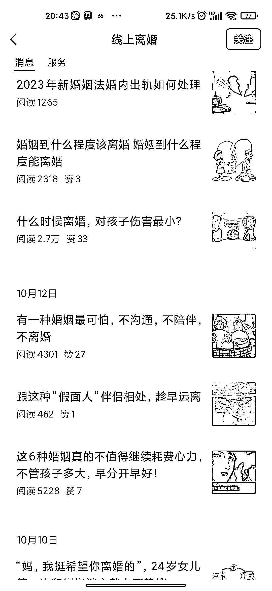
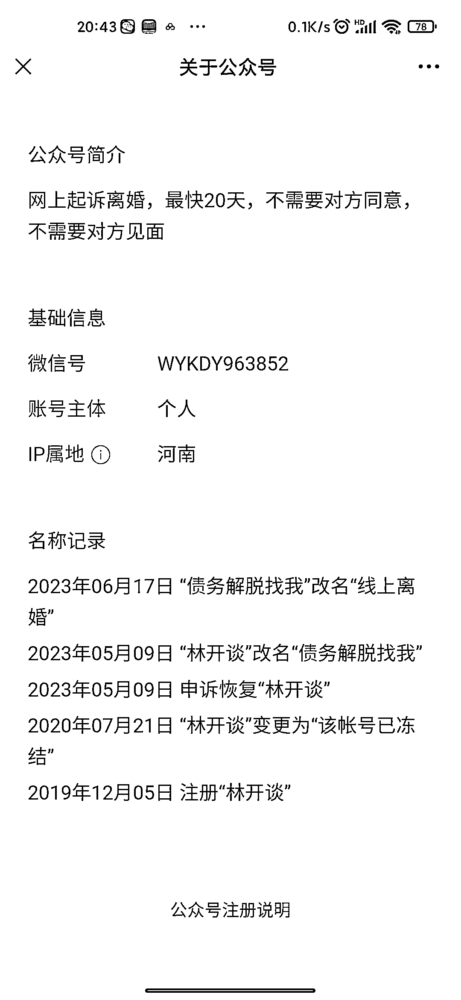

# 从债务解脱到网上起诉离婚，这个公众号的成功之路

> 原文：[`www.yuque.com/for_lazy/xkrm14/tcm84otmsavabn0s`](https://www.yuque.com/for_lazy/xkrm14/tcm84otmsavabn0s)

作者： 阿道

日期：2023-10-23

点赞数：**74**

* * *

正文：

这个公众号一开始注册本来是搞债务解脱的，应该做不起来，然后又换了网上起诉离婚的领域。
然后在这个垂直领域坚持日更发文，刚好赶上公众号流量红利，就这样做起来了，按照我做号的经验，这个阅读量，一天加的人有 100 上下。

* * *

评论区：

窝牛 : 这个是抓住了线上离婚这个关键词

华龙 : 应该同步在做小红书吧，好像刷到过好几个河南的账号。

艾小飞 : 我刚想这么说

能量菌 : 只有这一个账号么？

阿道 : 应该不止

阿道 : 感谢老大🌹🌹🌹

渊杰 : 现在有推荐流 是不是不一定会加这么多

* * *

公众号懒人找资源，懒人专属群分享