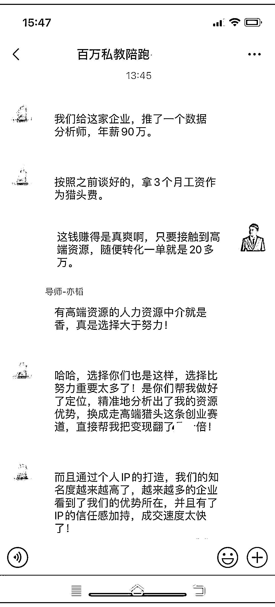

# 发展副业，人力资源更多，生财机会大

> 原文：[`www.yuque.com/for_lazy/xkrm14/rqkpi3dzy9gxe04t`](https://www.yuque.com/for_lazy/xkrm14/rqkpi3dzy9gxe04t)

作者： 金琳

日期：2023-10-24

点赞数：**64**

* * *

正文：

前几天在朋友圈看到的，生财的人力资源更多，可以专门弄个小团队来发展一下这个副业[呲牙]

* * *

评论区：

小吴姐 : 前提是得有那么多愿意给高薪的 headaccount。没有需求，需求极小，就是伪需求

金琳 : 所以只能当个副业来发展[呲牙]

程序员卡诺 : 这不就是猎头么，之前在大厂还有人专门赚内推的钱的，不知道现在咋样了

金琳 : 哇，终于中标了，谢谢亦仁大大！

能量菌 : 修改简历和面试技巧也是必备的技能

Q : 想要灵活做单的可以联系我（VX：2353381898），我们公司做了个人才推荐平台

* * *

