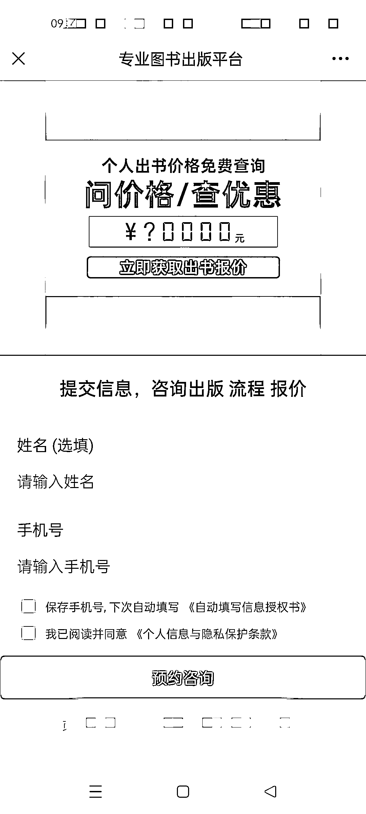
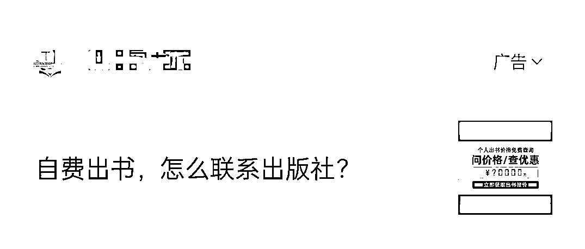

# 自媒体扩大影响力的有效策略：出书当 IP 背书

> 原文：[`www.yuque.com/for_lazy/xkrm14/nlt7mgf5m7zq5fbp`](https://www.yuque.com/for_lazy/xkrm14/nlt7mgf5m7zq5fbp)

作者： 诚意 v9(不闲聊)

日期：2023-10-24

点赞数：**58**

* * *

正文：

看到一个潜在的风向标，目前做自媒体的人越来越多，有很多人都拿到了一些成果，也有一些人想要进一步扩大影响力，一个很有效的策略就是出书，当做 IP 背书，不管有没有人看过，简介里面一说，会给人一种很牛的感觉。目前很多头部 IP 都是这么操作的，未来很多腰部的 IP 可能也会这样走。
围绕赚钱的方法就是：1，找资源当中介。上头对接 IP，下游对接出版社资源。 2，自己当 IP 出书，用来背书。
这两种方法一种是挖金矿，一种是金矿旁边卖水卖铲子，应该都能赚钱，关键看怎么操作和运营了。

* * *

评论区：

诚意 v9(不闲聊) : 哇，开心[呲牙][呲牙][呲牙]

胖大魔 : [奸笑]我也有资源

诚意 v9(不闲聊) : 来来来介绍介绍

胖大魔 : 不强势

冰雨幻天 : 很多 ip 确实有出书的需求~去提升自己的影响力

城市隐者 : 这个想法比较好。我有很多同学都在出版社，找出版社资源可以对接我

姬小光 : 我知道好几个都是一条龙服务，先教你做 IP，然后写书，出版

* * *

